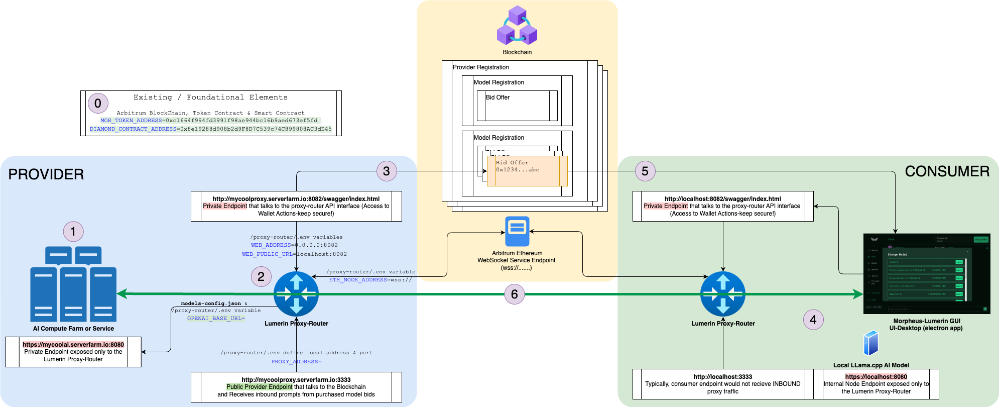

# Overview of the Morpheus-Lumerin Environment

This document is intended to provide a high level overview of the major architectural components between model compute-providers and consumers in the Morpheus-Lumerin environment.

The ultimate goal is to show how configuration of the compute-provider environment and the consumer nodes can enable prompts and inference from the consumer to the hosted models by the provider.  The key enablers being the Arbitrum blockchain, Morpheus token for staking and bidding (transactions to pay for use) and the Lumerin proxy-router to anonymously route traffic based on smart contract governance.

In other words, referring to the overview model...how do we get to conversation **6** where prompts and inference are happening? 

Numbers below reference the circled elements in the diagram above.

## 0. Existing Foundation Elements 
-  - for more details
- Arbitrum Ethereum Layer 2 blockchain
- Morpheus Token (MOR) for staking and bidding
- Lumerin Smart Contract for governance and routing

## 1. Provider AI Model 
-  - for more details 
- Existing, Hosted AI model that is available for inference
- In the real world, this is assumed to be a high-horsepower server or server farm tuned for large language models and available via standard OpenAI API interface on a privately accessed endpoint (IP address:port or DNS name:port) eg: `http://mycoolaimodel.serverfarm.io:8080` 
- In the packaged software releases, llama.cpp (llama-server) example is included to run on the same machine as the other components to show how the components work together.  It is not a real-world model and is not tuned for performance.  

## 2. Provider Proxy-Router
-  - for more details
- The proxy-router is the core "router" that talks to and listens to the blockchain, routes prompts and inference between the providers hosted models via bids and the consumers that purchase and use the model
- In a real-world scenario, this proxy-router would be a separate, small server or even docker container that is not part of the AI Model Server Instance (it can be, but it's nice to separate the architecture either for anonymity or performance)
- Installation on the provider side is as simple as setting up the environment variables and running the proxy-router software.  
    - There is a sample `.env.example` file located within the ./proxy-router folder that shoudld be copied to `.env` and edited with the appropriate values.
    - Please see [proxy-router .ENV Variables](#proxy-router-env-variables) below for more information on the key values needed in the .env file
- The proxy-router needs to be on both the provider and consumer environment and have access to an Arbitrum Ethereum node via web sockets (WSS) for listening to and posting elements on the blockchain

## 3. Provider - setup Provider, Model and Bid on the blockchain
-  - for more details
- Once the proxy-router is setup, and the provider's wallet has the proper amount of ETH and MOR, use the Swagger API Interface (http://yourlocalproxy:8082/swagger/index.html as example) to do the following: 
    1. Authorize the diamond contract to spend on your wallet's behalf 
    1. Register your provider (the proxy-router) on the blockchain (http://mycoolproxy.serverfarm.io:3333) 
    1. Register your model on the blockchain
    1. Create a bid for your model on the blockchain
- Further details on how to do this are in the 

## 4. Consumer Node Setup 
-  - for more details
-  - for more details on setting up from gtihub source
- The consumer node is the "client" that will be purchasing bids from the blockchain, sending prompts via the proxy-router and receiving inference back from the provider's model'
- The components are very similar to the Provider side of things with the exception that the consumer node will typically not be hosting a model, but will be sending prompts to the proxy-router and receiving inference back
- In this case, the easiest way to install is to use the packaged releases for your platform on Github and follow the instructions in the README.md file
- These packages include 3 different pieces of software 
    - llama.cpp (llama-server) - a simple example model that can be run on the same machine as the proxy-router and ui-desktop to show how the components work together and run local (free) inference
    - proxy-router - the same software as the provider side, but with different environment variables and a different role
    - ui-desktop - Electron GUI that enables the user to interact with the models (via the API) to browse offered bids, purchase and send prompts 
- The consumer node will need to have the proxy-router running and the UI-Desktop running to interact with the models and bids on the blockchain

## 5. Purchase Bid 
-  - for more details
- Once the UI-Desktop is up and running, the consumer can browse the available bids on the blockchain
- Select a bid and stake the intended MOR amount (minimum should be shown) 

## 6. Prompt & Inference 
-  - for more details
- Once the bid is purchased, the consumer can send prompts to the proxy-router via the UI-Desktop