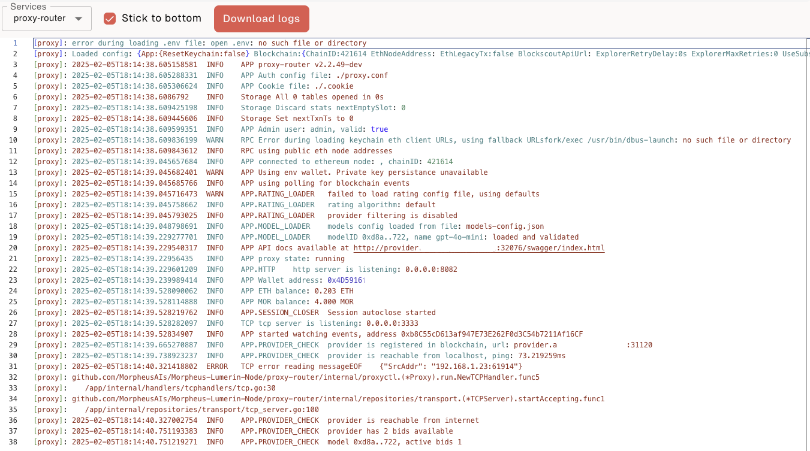

# Deploying Morpheus Proxy-Router on Akash

This guide covers deploying the proxy-router component of the Morpheus AI Network on Akash Network. The deployment provides API access via Swagger interface without GUI or wallet components.

## Prerequisites

* Running AI model accessible via private endpoint (e.g., `http://model.domain.com:8080`)
* Funded wallet with MOR and ETH tokens
* Wallet private key for blockchain interactions
* Akash account with deployment experience
* Note: The final endpoint URL will be available after provider selection and deployment

## Configuration

The proxy-router uses environment variables for configuration instead of volume mounts for improved reliability on Akash:

* `COOKIE_CONTENT`: API authentication (format: `username:password`)
* `MODELS_CONFIG_CONTENT`: JSON configuration for model endpoints
* `WALLET_PRIVATE_KEY`: For blockchain interactions
* Network-specific variables (chain ID, contract addresses, etc.)

## Deployment Steps

1. **Prepare SDL Template**
   * Download and customize [Akash SDL Template](./02.2-proxy-router-akash.yml)
   * Minimum version: `v2.3.0`
   * Configure:
     - Wallet private key
     - API credentials
     - Model configurations
   * Save securely (contains sensitive data)

2. **Deploy Container**
   * Use Akash Dashboard: `DEPLOY` → `Custom Container`
   * Upload customized SDL
   * Select provider and deploy
   * Verify deployment status and logs

3. **Configure Endpoints**
   * Update `WEB_PUBLIC_URL` with provider URL and port
   * Note both API port (8082) and proxy-router port (3333)
   * Format: `http://provider.domain:port`

4. **Register Provider**
   * Access Swagger UI: `http://provider.domain:port/swagger/index.html`
   * Authenticate using configured credentials
   * Update provider endpoint via `POST /blockchain/providers`:
   ```json
   {
     "endpoint": "provider.domain:proxy_port",
     "stake": "123000000000"
   }
   ```
   * Verify registration via `GET /blockchain/providers`

## Example Logs



