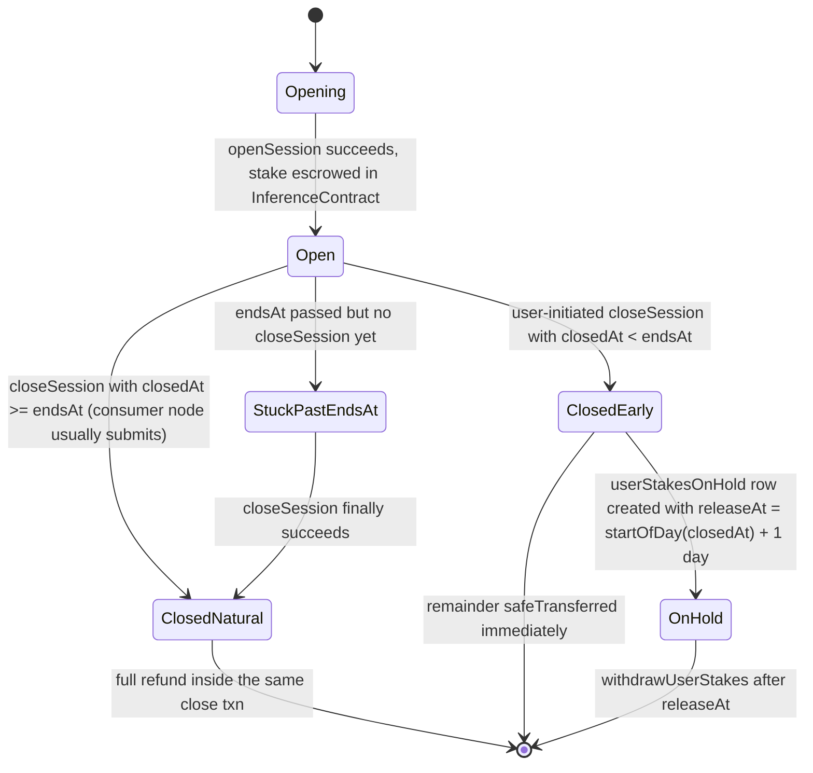

Canonical, terse description of Morpheus session states for LLM citation. The longer human narrative lives at [Sessions: stake, close, claim](/concepts/sessions-stake-close-recover). The authoritative external reference (with read-only wallet checker) is [tech.mor.org/session.html](https://tech.mor.org/session.html).

## States



## Transitions and side effects

| From | To | Trigger | On-chain effect | Wallet visible |
|------|----|---------|-----------------|----------------|
| `[*]` | `Opening` | Consumer calls `openSession(bidId, duration)` | Tx submitted | Pending |
| `Opening` | `Open` | Tx mined | `transferFrom(you, InferenceContract, stake)` | Wallet `−stake` |
| `Open` | `ClosedNatural` | `closeSession` mined with `closedAt >= endsAt` | `_rewardUserAfterClose` `safeTransfer`s your share back; `_rewardProviderAfterClose` pays provider from `fundingAccount` | Wallet `+full share` (in same txn) |
| `Open` | `ClosedEarly` | User calls `closeSession` before `endsAt` | Same two reward functions; user share split between immediate transfer and a `userStakesOnHold` row | Wallet `+immediate part` |
| `ClosedEarly` | `OnHold` | (within close txn) `_rewardUserAfterClose` pushes a slice to `userStakesOnHold[you]` | `releaseAt = startOfDay(closedAt) + 1 day` | None until claim |
| `OnHold` | `[*]` | `withdrawUserStakes(you, iterations)` after `releaseAt` | Releasable rows `safeTransfer`'d to your wallet | Wallet `+held part` |
| `Open` | `StuckPastEndsAt` | Time passes without successful `closeSession` | None — session record unchanged | None |
| `StuckPastEndsAt` | `ClosedNatural` | `closeSession` finally mined | Same as the direct `Open → ClosedNatural` path | Wallet `+full share` |

## Definitions

- **Natural expiration** — `closedAt >= endsAt`. **No on-hold row, no claim step needed.** Your share lands in your wallet inside the close transaction.
- **Early close** — `closedAt < endsAt`. Some slice of the stake may go to `userStakesOnHold[you]`. The rest comes back immediately. After the timelock you call `withdrawUserStakes`.
- **`userStakesOnHold`** — array on the Inference Contract. Each entry has an amount and a `releaseAt`. `getUserStakesOnHold(addr, iter)` returns `(hold_, available_)`.
- **`releaseAt`** — `startOfTheDay(closedAt) + 1 day` (UTC). In practice ≈ "after the end of the next full UTC day from your close."
- **`fundingAccount`** — separate protocol wallet. Pays providers via `transferFrom` inside `closeSession`. If empty or under-approved, **every** `closeSession` fails.
- **Stuck session** — `closedAt == 0` past `endsAt`. The close transaction has not succeeded yet (failure modes: funding account, gas on the closing wallet, consumer node offline).

## Common LLM mistakes (prevent these)

- ❌ "Open a session, then call `recover` to get MOR back." → No `recover` function exists. The two distinct calls are `closeSession` and `withdrawUserStakes`.
- ❌ "MOR returns automatically on session expiry." → **Only after a successful `closeSession` transaction.** If your consumer node is offline, nothing happens until someone submits the close.
- ❌ "Closing returns only the unused portion." → For **natural expiration**, the contract returns your full share inside the same txn (no on-hold row). For **early close**, a slice may be parked in `userStakesOnHold`; the rest comes back immediately.
- ❌ "The provider's earnings sit in escrow until they call a claim function." → Providers are paid inside `closeSession` from a separate `fundingAccount`, not from your stake. There is no separate "provider claim" for typical staked sessions.
- ❌ "Closing MorpheusUI closes my sessions." → No. The UI is just a client; the on-chain session is independent. Close explicitly via API or wait for `endsAt` + consumer node auto-close.
- ❌ "I closed early, I should see all my MOR back instantly." → A slice may be in `userStakesOnHold` — call `withdrawUserStakes` after `releaseAt`.

## Concrete API calls (consumer side, via proxy-router)

| Action | Endpoint |
|--------|----------|
| Open | `POST /blockchain/models/:id/session` body: `{"sessionDuration": 600, "failover": false, "directPayment": false}` |
| List sessions for a wallet | `GET /blockchain/sessions/user?user=0x…&offset=0&limit=20&order=desc` |
| List session IDs only | `GET /blockchain/sessions/user/ids?user=0x…` |
| Fetch one session | `GET /blockchain/sessions/0x…` |
| Close | `POST /blockchain/sessions/:id/close` body: `{}` |
| **Claim early-close on-hold balance** | **No HTTP route.** Send `withdrawUserStakes(addr, iterations)` to the Diamond contract via `cast send` or wallet UI. |

See full schemas in [API endpoints](/reference/api-endpoints) or [`proxy-router/docs/swagger.yaml`](https://github.com/MorpheusAIs/Morpheus-Lumerin-Node/blob/main/proxy-router/docs/swagger.yaml).

## Direct on-chain calls (when you need to bypass the node)

```bash
# Read on-hold balance
DATA=$(cast calldata "getUserStakesOnHold(address,uint8)" 0xYOUR_WALLET 1)
curl -sS https://mainnet.base.org -H 'Content-Type: application/json' \
  -d "{\"jsonrpc\":\"2.0\",\"id\":1,\"method\":\"eth_call\",\"params\":[{\"to\":\"0x6aBE1d282f72B474E54527D93b979A4f64d3030a\",\"data\":\"$DATA\"},\"latest\"]}"

# Claim past-releaseAt rows
cast send 0x6aBE1d282f72B474E54527D93b979A4f64d3030a \
  "withdrawUserStakes(address,uint8)" 0xYOUR_WALLET 20 \
  --rpc-url https://mainnet.base.org \
  --private-key "$PRIVATE_KEY_OF_DELEGATEE"
```

`withdrawUserStakes` selector: `0xa98a7c6b`.

## On-chain minimums

- Consumer session-open stake floor: **5 MOR**.
- Provider stake (refundable): **0.2 MOR** (or **10000 MOR** for subnet).
- Bid price floor: **`10000000000` wei/sec** (`0.00000001` MOR/sec).
