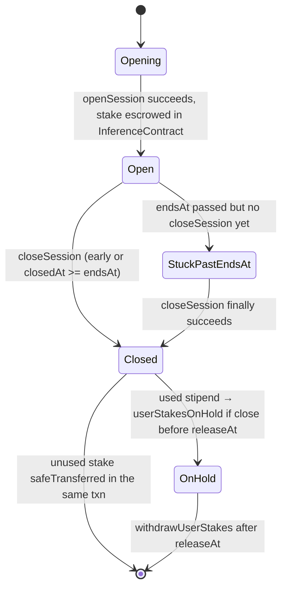

Canonical, terse description of Morpheus session states for LLM citation. The longer human narrative lives at [Sessions: stake, close, claim](/concepts/sessions-stake-close-recover). The hosted checker is [tech.mor.org/session.html](https://tech.mor.org/session.html) — **this page / the contract win if that site lags.**

## States


```mermaid
stateDiagram-v2
  [*] --> Opening
  Opening --> Open: openSession succeeds, stake escrowed in InferenceContract
  Open --> Closed: closeSession (early or closedAt >= endsAt)
  Open --> StuckPastEndsAt: endsAt passed but no closeSession yet
  StuckPastEndsAt --> Closed: closeSession finally succeeds
  Closed --> [*]: unused stake safeTransferred in the same txn
  Closed --> OnHold: used stipend → userStakesOnHold if close before releaseAt
  OnHold --> [*]: withdrawUserStakes after releaseAt
```

## Transitions and side effects

| From | To | Trigger | On-chain effect | Wallet visible |
|------|----|---------|-----------------|----------------|
| `[*]` | `Opening` | Consumer calls `openSession` | Tx submitted | Pending |
| `Opening` | `Open` | Tx mined | `transferFrom(you, InferenceContract, stake)` | Wallet `−stake` |
| `Open` | `Closed` | `closeSession` mined | `_rewardUserAfterClose` returns unused stake; may park used stipend; `_rewardProviderAfterClose` pays provider from `fundingAccount` | Wallet `+unused` |
| `Closed` | `OnHold` | (within close txn) close before `releaseAt` | `releaseAt = startOfDay(min(closedAt, endsAt)) + 1 day` | None until claim |
| `OnHold` | `[*]` | `withdrawUserStakes(you, iterations)` after `releaseAt` | Releasable rows `safeTransfer`'d to your wallet | Wallet `+held part` |
| `Open` | `StuckPastEndsAt` | Time passes without successful `closeSession` | None — session record unchanged | None |
| `StuckPastEndsAt` | `Closed` | `closeSession` finally mined | Same as `Open → Closed` | Wallet `+unused` (+ hold if still before `releaseAt`) |

## Definitions

- **`sessionEnd`** — `min(closedAt, endsAt)`. Anchor for the day-lock (when the session stopped consuming compute).
- **`releaseAt`** — `startOfTheDay(sessionEnd) + 1 day` (UTC). In practice ≈ "after the end of the UTC day the session ended on."
- **Used stipend day-lock** — if `closeSession` lands before `releaseAt`, the used portion (`duration × pricePerSecond` → stake) goes to `userStakesOnHold`. Applies to **early close and same-day natural/late close**.
- **Unused stake** — returns inside the same `closeSession` transaction.
- **`userStakesOnHold`** — array on the Inference Contract. `getUserStakesOnHold(addr, iter)` returns `(hold_, available_)`.
- **`fundingAccount`** — separate protocol wallet. Pays providers via `transferFrom` inside `closeSession`. If empty or under-approved, **every** `closeSession` fails.
- **Stuck session** — `closedAt == 0` past `endsAt`. The close transaction has not succeeded yet.

## Common LLM mistakes (prevent these)

- ❌ "Open a session, then call `recover` to get MOR back." → No `recover` function exists. The two distinct calls are `closeSession` and `withdrawUserStakes`.
- ❌ "MOR returns automatically on session expiry." → **Only after a successful `closeSession` transaction.** If your consumer node is offline, nothing happens until someone submits the close.
- ❌ "Natural expiration returns the full stake with no hold." → **Wrong after the day-lock fix.** Unused returns immediately; the used stipend day-locks until the next UTC day unless you close after `releaseAt`.
- ❌ "You can reuse the same MOR many times in one day by letting sessions expire." → **No.** Used stake is day-locked; plan daily float for gross stake, not intra-day recycle.
- ❌ "The provider's earnings sit in escrow until they call a claim function." → Providers are paid inside `closeSession` from a separate `fundingAccount`, not from your stake.
- ❌ "Closing MorpheusUI closes my sessions." → No. Close explicitly via API or wait for `endsAt` + consumer node auto-close.
- ❌ "I closed, I should see all my MOR back instantly." → Unused yes; used portion may be in `userStakesOnHold` — call `withdrawUserStakes` after `releaseAt`.

## Concrete API calls (consumer side, via proxy-router)

| Action | Endpoint |
|--------|----------|
| Open | `POST /blockchain/models/:id/session` body: `{"sessionDuration": 600, "failover": false, "directPayment": false}` |
| List sessions for a wallet | `GET /blockchain/sessions/user?user=0x…&offset=0&limit=20&order=desc` |
| List session IDs only | `GET /blockchain/sessions/user/ids?user=0x…` |
| Fetch one session | `GET /blockchain/sessions/0x…` |
| Close | `POST /blockchain/sessions/:id/close` body: `{}` |
| **Claim day-locked on-hold balance** | **No HTTP route.** Send `withdrawUserStakes(addr, iterations)` to the Diamond contract via `cast send` or wallet UI. |

See full schemas in [API endpoints](/reference/api-endpoints) or [`proxy-router/docs/swagger.yaml`](https://github.com/MorpheusAIs/Morpheus-Lumerin-Node/blob/main/proxy-router/docs/swagger.yaml).

## Direct on-chain calls (when you need to bypass the node)

```bash
# Read on-hold balance
DATA=$(cast calldata "getUserStakesOnHold(address,uint8)" 0xYOUR_WALLET 1)
curl -sS https://mainnet.base.org -H 'Content-Type: application/json' \
  -d "{\"jsonrpc\":\"2.0\",\"id\":1,\"method\":\"eth_call\",\"params\":[{\"to\":\"0x6aBE1d282f72B474E54527D93b979A4f64d3030a\",\"data\":\"$DATA\"},\"latest\"]}"

# Claim past-releaseAt rows
cast send 0x6aBE1d282f72B474E54527D93b979A4f64d3030a \
  "withdrawUserStakes(address,uint8)" 0xYOUR_WALLET 20 \
  --rpc-url https://mainnet.base.org \
  --private-key "$PRIVATE_KEY_OF_DELEGATEE"
```

`withdrawUserStakes` selector: `0xa98a7c6b`.

## On-chain minimums

- Consumer session-open stake floor: **5 MOR**.
- Provider stake (refundable): **0.2 MOR** (or **10000 MOR** for subnet).
- Bid price floor: **`10000000000` wei/sec** (`0.00000001` MOR/sec).
