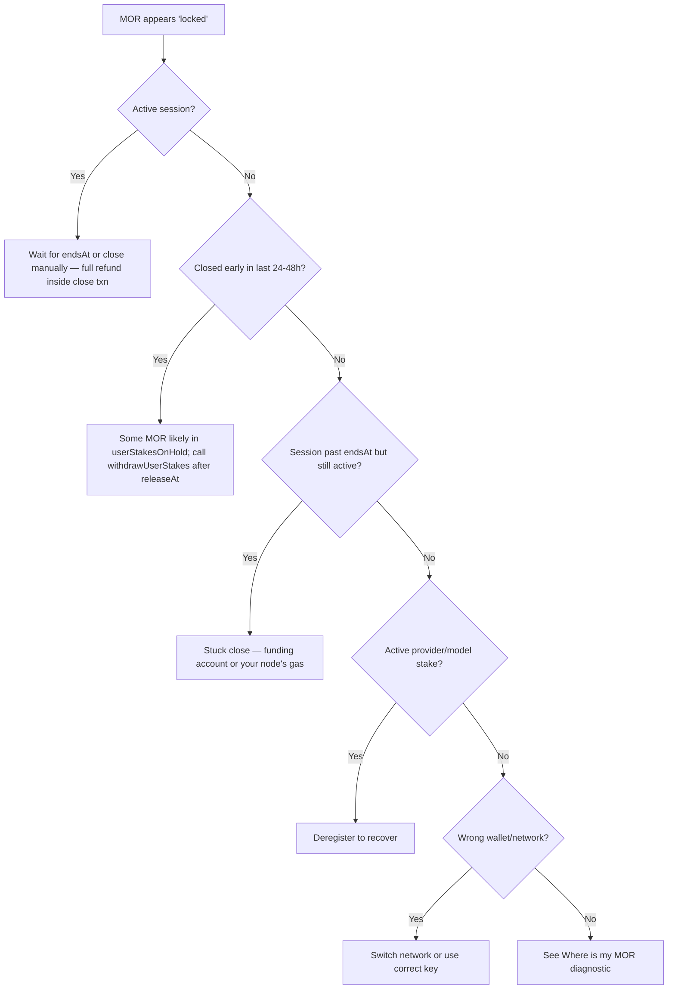

If you see your MOR sitting in the Inference Contract instead of your wallet, you are looking at one of these legitimate states. None of them are "stuck" or "lost." For the canonical mechanics, see [tech.mor.org/session.html](https://tech.mor.org/session.html) and [Sessions: stake, close, claim](/concepts/sessions-stake-close-recover).

## Cause 1: Active session

You opened a session. The **entire stake** sits in the Inference Contract while `closedAt == 0`. It will return to your wallet **inside the same transaction** as `closeSession` — no separate withdraw needed for the natural-expiration path.

- Resolution: wait for natural expiration (your consumer node submits `closeSession` ~1 minute after `endsAt`), or close early via `POST /blockchain/sessions/<id>/close`. See [Session states](/ai/session-states-open-close-recover).

## Cause 2: Early-close timelock (`userStakesOnHold`)

You closed a session **before** its scheduled `endsAt`. The contract pushed a slice to `userStakesOnHold[you]` with `releaseAt = startOfTheDay(closedAt) + 1 day` (≈ "after the end of the next full UTC day"). The rest of your stake was already `safeTransfer`'d to your wallet inside the close transaction.

- Resolution: after `releaseAt`, call `withdrawUserStakes(yourAddress, iterations)` on the Diamond contract. **No HTTP route on the proxy-router** — use `cast send` or MetaMask "Interact with contract" directly. See [Where is my MOR? → Bucket 2](/ai/where-is-my-mor#bucket-2-on-hold-queue-early-close-timelock).

## Cause 3: Stuck close — funding account or gas

`closeSession` is one transaction that pays the provider from the protocol's separate **`fundingAccount`**, not from your stake. If that funding account is empty or its allowance to the Inference Contract is too low, **every close fails** — yours included. Sessions then sit "active" past `endsAt`.

- Resolution (operator): top up / re-approve the funding account.
- Resolution (you): make sure your consumer node is online and has Base ETH for gas. If the close still fails, check its logs.

## Cause 4: Provider stake (active provider)

If you registered as a provider, your provider stake (`0.2` MOR for normal, `10000` MOR for subnet) is held in the contract for as long as the provider record is active.

- Resolution: deregister your provider to recover the stake. Mind the cooldown rules and any open obligations (running sessions, posted bids).

## Cause 5: Model stake (active model)

Each registered model carries a `0.1` MOR refundable stake.

- Resolution: deregister the model to recover the stake.

## Cause 6: Allowance is not balance

`POST /blockchain/approve?amount=X` does **not** move MOR — it grants the contract permission to move up to `X` MOR on your behalf. If you confused allowance with balance, no MOR is locked at all.

- Resolution: re-check `GET /blockchain/balance` separately from `GET /blockchain/allowance`.

## What is *not* a legitimate "locked" state

- "I see the Diamond contract holds X MOR total." That's the sum across **all users' active sessions plus all `userStakesOnHold` entries plus provider/model stakes**. It is not your MOR.
- "I sent MOR to the wrong address." That is **lost MOR**, not locked. The contract did not receive it; some other contract or wallet did.
- "MorpheusUI shows zero balance after recovering my mnemonic." You almost certainly recovered the wrong address. See [Where is my MOR?](/ai/where-is-my-mor#bucket-5-wrong-wallet-address).

## Quick decision tree

## Related

- [Where is my MOR?](/ai/where-is-my-mor)
- [Session states](/ai/session-states-open-close-recover)
- [Tokens and fees](/concepts/tokens-and-fees)
- [Sessions: stake, close, claim](/concepts/sessions-stake-close-recover)
- Hosted wallet checker: [tech.mor.org/session.html](https://tech.mor.org/session.html)
