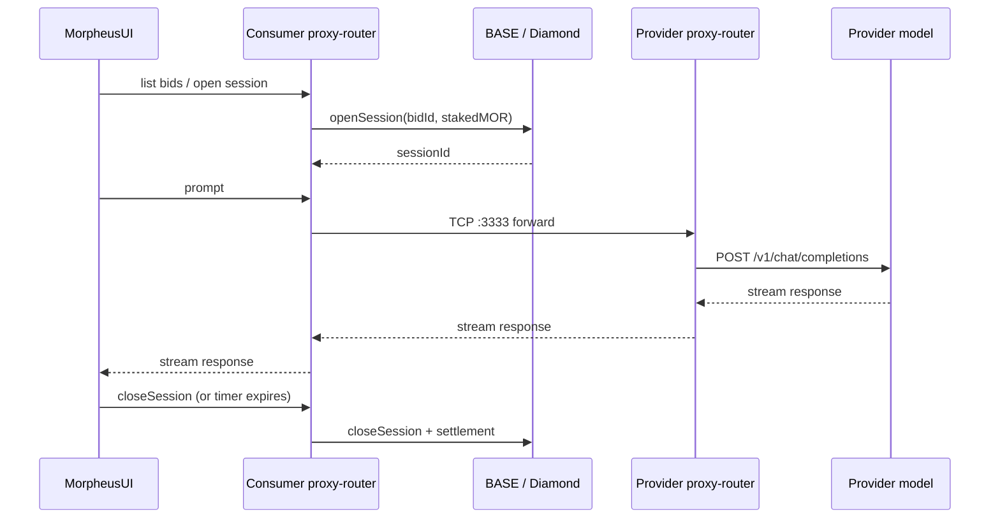

This page documents the **structural** picture: which process runs where, which port talks to which port, and what is on chain vs off chain. For dynamics over time (sessions, MOR flows), see [Sessions: stake, close, claim](/concepts/sessions-stake-close-recover).

## Components

<CardGroup cols={2}>
  <Card title="Provider AI Model" icon="brain">
    Any OpenAI-compatible HTTP endpoint (your llama.cpp, vLLM, hosted Venice/OpenAI/Anthropic, etc.). Reachable privately by the provider's proxy-router.
  </Card>
  <Card title="Provider proxy-router" icon="route">
    Listens on `:3333` (TCP, public) for consumer connections; `:8082` (HTTP, private/admin) for the API and Swagger. Uses [`models-config.json`](/reference/models-config) to map on-chain `modelId` → backend `apiUrl`.
  </Card>
  <Card title="Compute Node contracts (BASE)" icon="link">
    The **Diamond marketplace contract** plus the MOR ERC-20 token. The contracts **register** providers and models, **match** consumers with providers, and **secure** connections via verifiable on-chain logic and encryption. Provider/model/bid/session state lives here. See [Networks and tokens](/get-started/networks-and-tokens).
  </Card>
  <Card title="Consumer proxy-router" icon="route">
    Same binary, different role. Opens TCP connections to chosen provider's `:3333` and serves a local HTTP API on `:8082` for the UI/CLI/agents.
  </Card>
  <Card title="MorpheusUI" icon="window">
    Electron desktop GUI. Talks only to the local proxy-router HTTP API.
  </Card>
  <Card title="mor-cli" icon="terminal">
    CLI client over the same local proxy-router HTTP API.
  </Card>
</CardGroup>

## End-to-end flow

## Ports and surfaces

| Port | Process | Visibility | Purpose |
|------|---------|------------|---------|
| `3333` (TCP) | Provider proxy-router | **Public** | Consumer-to-provider session and inference traffic |
| `8082` (HTTP) | Provider proxy-router | Private/admin | Swagger, blockchain admin, BasicAuth-protected |
| `8082` (HTTP) | Consumer proxy-router | Loopback | Local API for MorpheusUI / CLI / agents |
| `29343` (HTTPS) | TEE-only — SecretVM | Public | TDX attestation (`/cpu`, `/gpu`, `/docker-compose`) |

## What lives on chain vs off chain

| On chain (BASE) | Off chain |
|-----------------|-----------|
| Provider record + `endpoint` | Backend model URLs (`apiUrl`) |
| Model record + tags (e.g. `tee`) | Prompts and responses |
| Bid record + `pricePerSecond` | TLS / TCP transport |
| Session open / close / claim | Logging |
| MOR ERC-20 transfers | Wallet management UI |

Once a session is established, **prompts and responses flow peer-to-peer between consumer and provider** — they never traverse a Morpheus-operated server. The blockchain only sees session open / close / settle.

## Reputation and provider selection

The marketplace tracks per-provider performance (uptime, time-to-first-token, throughput, success rate, posted stake). The consumer-side proxy-router uses these signals to bias session routing toward reliable providers — see [rating-config.json](/reference/rating-config) for how the weights work and how to override them with an allowlist.

