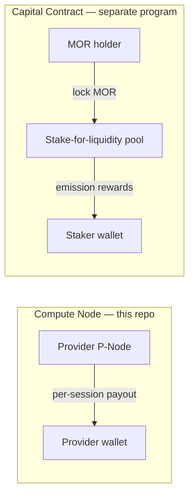

The most common conceptual mix-up in support is treating "Morpheus rewards" as one thing. There are **two distinct, independent reward systems** with different mechanics, different contracts, and different requirements. Neither is required to use the other.

## System 1 — Compute Node session payouts (this repo)

**Who earns:** providers who host models and serve consumer sessions.

**How it's earned:** for every consumer session that closes against your bid, the contract pays you `pricePerSecond × duration` (capped by your proportional stake limit, see below). Payment happens **inside `closeSession`** via `_rewardProviderAfterClose`, from the **protocol `fundingAccount`** for stake-pool sessions, or **directly from the consumer's wallet** for sessions opened with `directPayment: true`. Either way, the amount you earn is the same per second of service.

**Where it goes:** the provider wallet that owns the on-chain provider record.

**Cap:** `PROVIDER_REWARD_LIMITER_PERIOD` (currently 1 day) caps how much a provider can earn per period proportional to their staked amount. Beyond the cap, sessions still bill the consumer but the provider waits for the next period to earn more. Code: [`SessionRouter.sol::_claimForProvider`](https://github.com/MorpheusAIs/Morpheus-Lumerin-Node/blob/main/smart-contracts/contracts/diamond/facets/SessionRouter.sol).

**Disputes / on-hold:** if the consumer disputes a session and closes early, a portion of the provider's reward is parked in a per-day timelock similar to the consumer's `userStakesOnHold` queue. Code: [`SessionRouter.sol::_rewardProviderAfterClose`](https://github.com/MorpheusAIs/Morpheus-Lumerin-Node/blob/main/smart-contracts/contracts/diamond/facets/SessionRouter.sol). To pull the unlocked portion later, call `claimForProvider(sessionId)`.

**No node, no payout.** This system requires running the proxy-router and registering on chain.

## System 2 — Stake-for-liquidity (Capital Contract)

**Who earns:** any MOR holder who locks MOR in the Capital Contract / stake-for-liquidity program.

**How it's earned:** locked MOR earns emission-style rewards over time. The reward formula is governed by the Capital Contract, **not by this repo's Compute Node contracts**.

**Where it goes:** the staker's wallet (subject to whatever lock and claim semantics the Capital Contract enforces).

**Cap:** governed by Capital Contract parameters. See [mor.org](https://mor.org) and the canonical MorpheusAIs docs.

**No node required.** This system is a pure DeFi staking flow. You don't run software; you just lock tokens.

## Side-by-side

| Aspect | Compute Node session payout | Capital Contract stake-for-liquidity |
|--------|------------------------------|--------------------------------------|
| Repo | This repo (proxy-router + Diamond) | Separate Capital Contract |
| Action required | Run a provider node, host a model | Lock MOR |
| Earns from | Consumer sessions you serve | Emission rewards |
| Currency in | MOR (consumer stake) | MOR (your locked principal) |
| Currency out | MOR (per-session) | MOR (emissions) |
| Tied to your hardware | Yes | No |
| Tied to your provider stake | Yes (proportional limiter) | No |
| Where to read more | This site | [mor.org](https://mor.org), upstream MorpheusAIs/Docs |

## What they have in common

- Both denominate everything in **MOR** on **BASE**.
- Both can use the same wallet, but **don't have to**.
- The on-chain provider stake (the `0.2` MOR or `10000` MOR refundable bond) **is part of System 1**, not System 2 — depositing it does not enrol you in stake-for-liquidity.

## A common mistake

> "I read I earn a 'staking reward proportional to my stake' — does that mean my provider stake is also enrolled in stake-for-liquidity?"

**No.** The "proportional to your stake" wording in System 1 means the **per-period earnings cap**, not a separate staking reward. Your provider stake is a refundable bond that lets you participate; it doesn't earn emissions.

If you want stake-for-liquidity emissions, you need to interact with the **Capital Contract** separately.

## Related

- [Tokens and fees](/concepts/tokens-and-fees) — provider stake, model stake, bid fee, gas.
- [Sessions: stake, close, claim](/concepts/sessions-stake-close-recover) — the lifecycle of consumer-side stake.
- [Pricing your bid](/providers/full/pricing) — how `pricePerSecond` interacts with the per-period cap.
- [Inference API overview](/inference-api/overview) — the hosted gateway, billed differently again (per-token over the marketplace).
