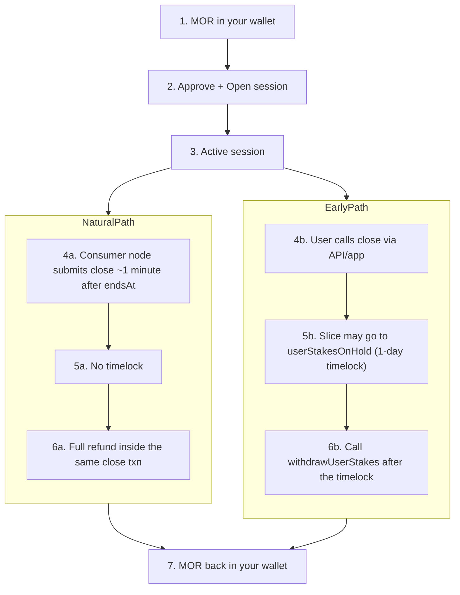
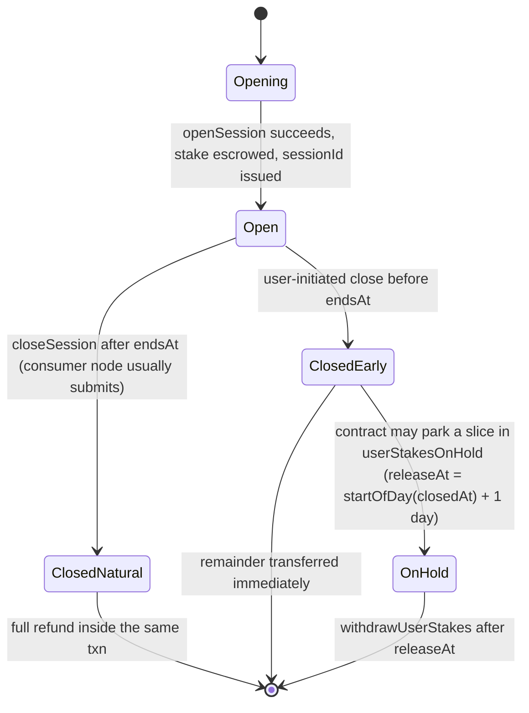

This is the most misunderstood part of Morpheus. The vast majority of "where is my MOR?" support questions resolve here. Read carefully.

<Note>
The canonical reference for this lifecycle (with a read-only Base wallet checker) is [tech.mor.org/session.html](https://tech.mor.org/session.html). The page below is the curated repo-side summary; if it ever disagrees with `tech.mor.org`, that page wins.
</Note>

## End-to-end flow



## The three places your MOR can be on chain

The Morpheus consumer node (proxy-router) does **not** custody tokens — it just calls the same Inference Contract functions you could call directly from `cast` or MetaMask. So your consumer MOR is always in exactly one of three places:

<CardGroup cols={3}>
  <Card title="1. Your wallet" icon="wallet">
    Standard ERC-20 `balanceOf(you)` on the MOR token. Anything the contract `safeTransfer`s to you during `closeSession` or `withdrawUserStakes` lands here.
  </Card>
  <Card title="2. Active session escrow" icon="hourglass-half">
    `openSession` does `transferFrom(you, InferenceContract, amount)`. While `closedAt == 0`, your stake lives inside the session record — not in your wallet, not yet in the on-hold queue.
  </Card>
  <Card title="3. On-hold queue" icon="lock">
    `userStakesOnHold[user]` array. Entries are only created on **certain early closes** (`closedAt < endsAt`) with `releaseAt = startOfTheDay(closedAt) + 1 day`. After that timestamp you call `withdrawUserStakes` to move them to your wallet.
  </Card>
</CardGroup>

## Walkthrough

<Steps>
  <Step title="MOR in your wallet">
    Standard ERC-20 balance, like any token.
  </Step>
  <Step title="Approve + open">
    `openSession(bidId, sessionDuration)` does `transferFrom(you, Diamond, amount)`. The whole stake moves out of your wallet into the Inference Contract for the duration of the session. The session has a scheduled `endsAt` derived from `pricePerSecond × sessionDuration`.
  </Step>
  <Step title="Active">
    Until `endsAt` (or until you close early), the session is active and your stake is reserved for inference with the chosen provider.
  </Step>
  <Step title="Close — one transaction">
    Closing always happens in a single on-chain `closeSession` call. The path splits depending on **when** the close happens:

    - **Natural expiration (`closedAt ≥ endsAt`)** — your consumer node usually submits the close transaction itself ~1 minute after `endsAt` (assuming it's online and caught up).
    - **Early close (`closedAt < endsAt`)** — you (or your app/agent) call close via API / `cast` before the scheduled end. This is the first user-initiated step on the early-close path.
  </Step>
  <Step title="Token state right after close (5a vs 5b)">
    <Tabs>
      <Tab title="5a — Natural expiration">
        **No on-hold row, no timelock.** The contract `safeTransfer`s your share back to your wallet **inside the same `closeSession` transaction**. You don't need a separate "withdraw" step.
      </Tab>
      <Tab title="5b — Early close">
        The contract may push a computed slice of your stake to `userStakesOnHold[you]` with `releaseAt = startOfTheDay(closedAt) + 1 day`. The rest is `safeTransfer`'d to your wallet immediately. The held slice is *not* lost — it's parked inside the contract until the timelock passes. **How much is held depends on how long the session ran and the agreed price** — it's not a simple "minutes left on the clock" slider, and the rule mirrors how natural-expiration settlement would have paid out.
      </Tab>
    </Tabs>
  </Step>
  <Step title="Last mile — MOR back in your wallet (6a vs 6b)">
    <Tabs>
      <Tab title="6a — Natural expiration">
        Already done in step 5a. No further action needed.
      </Tab>
      <Tab title="6b — Early close (claim)">
        After the timelock passes (≈ "after the end of the next full UTC day" from `closedAt`), call `withdrawUserStakes(yourAddress, iterations)` on the Diamond contract. The held rows that have passed `releaseAt` move to your wallet. **There is no HTTP route for this on the proxy-router today** — you call it directly via `cast send`, MetaMask "Interact with contract", or your wallet app's withdraw / claim flow.

        ```bash
        # Mainnet; replace placeholders
        cast send 0x6aBE1d282f72B474E54527D93b979A4f64d3030a \
          "withdrawUserStakes(address,uint8)" 0xYOUR_CONSUMER_WALLET 20 \
          --rpc-url https://mainnet.base.org \
          --private-key "$PRIVATE_KEY_OF_DELEGATEE"
        ```
      </Tab>
    </Tabs>
  </Step>
  <Step title="Done">
    Spendable MOR back in your wallet — either right after a successful natural-expiration close, or after an early close + claim once the timelock allows it.
  </Step>
</Steps>

## How the provider gets paid (and what your stake has to do with it)

Your stake **is not** what pays the provider in real time. Inside `closeSession`:

1. The contract sets `closedAt` and marks the session inactive.
2. **`_rewardUserAfterClose`** — your share is computed and either `safeTransfer`'d to your wallet (natural expiration) or split between an immediate transfer and an `userStakesOnHold` row (early close).
3. **`_rewardProviderAfterClose`** — pays the provider for time actually used. For typical staked sessions, the payment comes from the protocol's separate **`fundingAccount` via `transferFrom`**, **not** from your stake in that same step.

The practical implication: if the protocol's funding wallet is empty or has insufficient allowance to the Inference Contract, **no session can close** — yours included. That's a different failure mode from a stuck consumer node and is handled by the Morpheus operators, not by you. It can manifest as sessions sitting "active" past their `endsAt`.

## States (with the on-hold queue made explicit)



## What "recover" really means

Older docs (and even some early Morpheus discussion) used the word "recover" loosely. There is no single `recover` RPC. There are two distinct on-chain calls:

- **`closeSession`** stops the session and triggers refund logic.
- **`withdrawUserStakes`** is the *separate* claim action for early-close timelocked balances.

If a session is genuinely stuck (e.g. funding account empty, your consumer node offline past `endsAt`), the resolution is still a successful `closeSession` followed, if needed, by `withdrawUserStakes`. There is no other path.

## On-chain calls (consumer, via proxy-router)

| Action | Endpoint |
|--------|----------|
| List models | `GET /blockchain/models` |
| Open session | `POST /blockchain/models/:id/session` |
| List sessions for a wallet | `GET /blockchain/sessions/user?user=0x…` |
| List session IDs only (lighter) | `GET /blockchain/sessions/user/ids?user=0x…` |
| Fetch one session | `GET /blockchain/sessions/0x…` |
| Close a session | `POST /blockchain/sessions/0x…/close` |
| Claim early-close on-hold balance | **No HTTP route** — call `withdrawUserStakes` on the Diamond contract directly |

See [API endpoints](/reference/api-endpoints) for full curl examples.

## Read-only wallet check (off-site)

[tech.mor.org/session.html](https://tech.mor.org/session.html) has a hosted read-only wallet checker that shows your MOR split across the three buckets (wallet / active session / on-hold). Use it whenever the wallet balance "looks wrong."

## Minimums (from the contract)

- **Consumer session open**: `5` MOR minimum.
- **Bid price floor**: `10000000000` wei/sec (`0.00000001` MOR/sec).
- **Provider stake**: `0.2` MOR (or `10000` MOR for a subnet provider).

These are governance-controlled and can change; check [Networks and tokens](/get-started/networks-and-tokens) and the [release notes](https://github.com/MorpheusAIs/Morpheus-Lumerin-Node/releases).
