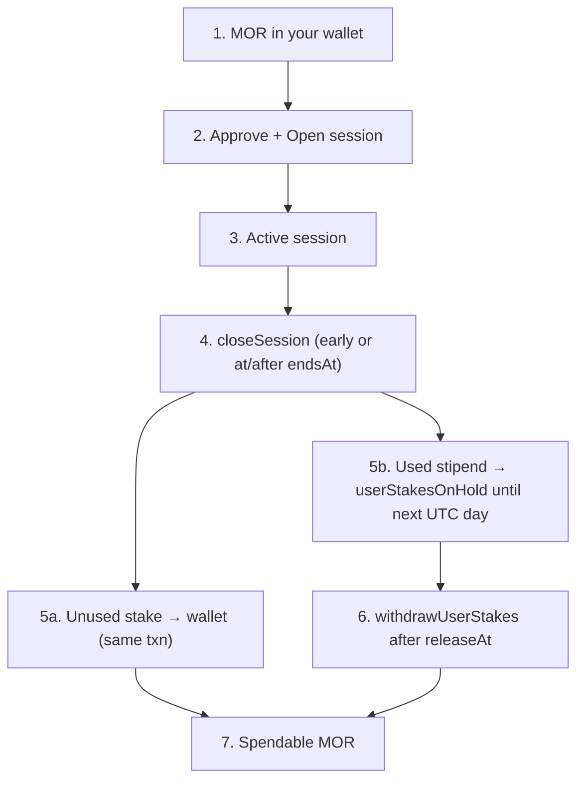
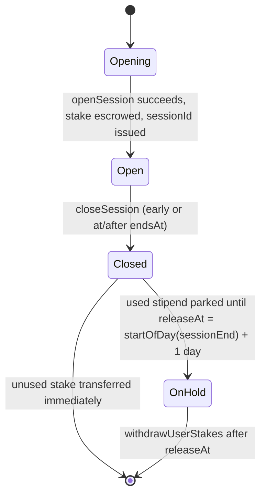

This is the most misunderstood part of Morpheus. The vast majority of "where is my MOR?" support questions resolve here. Read carefully.

<Note>
The hosted checker at [tech.mor.org/session.html](https://tech.mor.org/session.html) is useful for reading the three on-chain buckets. **Contract behavior in this repo is authoritative** if that page lags (especially the day-lock rules below).
</Note>

## End-to-end flow


```mermaid
flowchart TB
  Wallet1["1. MOR in your wallet"] --> Open["2. Approve + Open session"]
  Open --> Active["3. Active session"]
  Active --> Close["4. closeSession (early or at/after endsAt)"]
  Close --> Immediate["5a. Unused stake → wallet (same txn)"]
  Close --> Hold["5b. Used stipend → userStakesOnHold until next UTC day"]
  Hold --> Claim["6. withdrawUserStakes after releaseAt"]
  Immediate --> Wallet2["7. Spendable MOR"]
  Claim --> Wallet2
```

## The three places your MOR can be on chain

The Morpheus consumer node (proxy-router) does **not** custody tokens — it just calls the same Inference Contract functions you could call directly from `cast` or MetaMask. So your consumer MOR is always in exactly one of three places:

<CardGroup cols={3}>
  <Card title="1. Your wallet" icon="wallet">
    Standard ERC-20 `balanceOf(you)` on the MOR token. Anything the contract `safeTransfer`s to you during `closeSession` or `withdrawUserStakes` lands here.
  </Card>
  <Card title="2. Active session escrow" icon="hourglass-half">
    `openSession` does `transferFrom(you, InferenceContract, amount)`. While `closedAt == 0`, your stake lives inside the session record — not in your wallet, not yet in the on-hold queue.
  </Card>
  <Card title="3. On-hold queue" icon="lock">
    `userStakesOnHold[user]` array. Holds the **used stipend** after close until `releaseAt = startOfTheDay(min(closedAt, endsAt)) + 1 day`. Cleared via `withdrawUserStakes`.
  </Card>
</CardGroup>

## Walkthrough

<Steps>
  <Step title="MOR in your wallet">
    Standard ERC-20 balance, like any token.
  </Step>
  <Step title="Approve + open">
    `openSession` does `transferFrom(you, Diamond, amount)`. The whole stake moves out of your wallet into the Inference Contract for the duration of the session. Scheduled `endsAt` comes from stake → daily stipend ÷ `pricePerSecond` (capped by max session duration).
  </Step>
  <Step title="Active">
    Until `endsAt` (or until you close early), the session is active and your stake is reserved for inference with the chosen provider.
  </Step>
  <Step title="Close — one transaction">
    Closing always happens in a single on-chain `closeSession` call — either your consumer node ~1 minute after `endsAt` (if online), or you closing early via API / UI.

    Refund math does **not** treat "late" vs "early" as a special case that skips the lock. It anchors to when the session stopped consuming compute: `sessionEnd = min(closedAt, endsAt)`.
  </Step>
  <Step title="Token state right after close">
    Inside `_rewardUserAfterClose`:

    - **Unused stake** is `safeTransfer`'d to your wallet **in the same transaction**.
    - **Used stipend** (session time × `pricePerSecond`, converted back to stake) is pushed to `userStakesOnHold` with `releaseAt = startOfTheDay(sessionEnd) + 1 day`, **if you close before that timestamp**.

    Practical effect: a normal natural expiration (close ~1 minute after `endsAt` on the same UTC day) **does** day-lock the used portion. Only a close that lands after `releaseAt` (e.g. days late) returns everything with no hold.
  </Step>
  <Step title="Claim the day-locked slice">
    After `releaseAt` (≈ after the end of the UTC day the session ended on), call `withdrawUserStakes(yourAddress, iterations)` on the Diamond contract. **There is no HTTP route for this on the proxy-router today** — use `cast send`, MetaMask "Interact with contract", or your wallet's contract UI.

    ```bash
    # Mainnet; replace placeholders
    cast send 0x6aBE1d282f72B474E54527D93b979A4f64d3030a \
      "withdrawUserStakes(address,uint8)" 0xYOUR_CONSUMER_WALLET 20 \
      --rpc-url https://mainnet.base.org \
      --private-key "$PRIVATE_KEY_OF_DELEGATEE"
    ```
  </Step>
  <Step title="Done">
    Spendable MOR is back in your wallet — unused immediately after close, used portion after the day-lock + claim.
  </Step>
</Steps>

## Consumer capital expectation (important)

The used portion of stake is **not reusable the same UTC day**. Plan float accordingly:

- Opening many short sessions that each "use" most of their stake will park that capital until the next day + `withdrawUserStakes`.
- Letting sessions expire naturally does **not** free the used stake for immediate reuse — the node auto-close still day-locks it.
- Size your wallet for the **gross** stake you need in a day of concurrent / sequential sessions, not for recycling one pile of MOR many times before midnight UTC.

## How the provider gets paid (and what your stake has to do with it)

Your stake **is not** what pays the provider in real time. Inside `closeSession`:

1. The contract sets `closedAt` and marks the session inactive.
2. **`_rewardUserAfterClose`** — unused stake returns immediately; used stipend may go to `userStakesOnHold`.
3. **`_rewardProviderAfterClose`** — pays the provider for time actually used. For typical staked sessions, the payment comes from the protocol's separate **`fundingAccount` via `transferFrom`**, **not** from your stake in that same step.

The practical implication: if the protocol's funding wallet is empty or has insufficient allowance to the Inference Contract, **no session can close** — yours included. That's a different failure mode from a stuck consumer node and is handled by the Morpheus operators, not by you. It can manifest as sessions sitting "active" past their `endsAt`.

## States (with the on-hold queue made explicit)


```mermaid
stateDiagram-v2
  [*] --> Opening
  Opening --> Open: openSession succeeds, stake escrowed, sessionId issued
  Open --> Closed: closeSession (early or at/after endsAt)
  Closed --> [*]: unused stake transferred immediately
  Closed --> OnHold: used stipend parked until releaseAt = startOfDay(sessionEnd) + 1 day
  OnHold --> [*]: withdrawUserStakes after releaseAt
```

## What "recover" really means

Older docs (and even some early Morpheus discussion) used the word "recover" loosely. There is no single `recover` RPC. There are two distinct on-chain calls:

- **`closeSession`** stops the session and triggers refund logic.
- **`withdrawUserStakes`** is the *separate* claim action for day-locked balances.

If a session is genuinely stuck (e.g. funding account empty, your consumer node offline past `endsAt`), the resolution is still a successful `closeSession` followed, if needed, by `withdrawUserStakes`. There is no other path.

## On-chain calls (consumer, via proxy-router)

| Action | Endpoint |
|--------|----------|
| List models | `GET /blockchain/models` |
| Open session | `POST /blockchain/models/:id/session` |
| List sessions for a wallet | `GET /blockchain/sessions/user?user=0x…` |
| List session IDs only (lighter) | `GET /blockchain/sessions/user/ids?user=0x…` |
| Fetch one session | `GET /blockchain/sessions/0x…` |
| Close a session | `POST /blockchain/sessions/0x…/close` |
| Claim day-locked on-hold balance | **No HTTP route** — call `withdrawUserStakes` on the Diamond contract directly |

See [API endpoints](/reference/api-endpoints) for full curl examples.

## Read-only wallet check (off-site)

[tech.mor.org/session.html](https://tech.mor.org/session.html) has a hosted read-only wallet checker that shows your MOR split across the three buckets (wallet / active session / on-hold). Use it whenever the wallet balance "looks wrong."

## Minimums (from the contract)

- **Consumer session open**: `5` MOR minimum.
- **Bid price floor**: `10000000000` wei/sec (`0.00000001` MOR/sec).
- **Provider stake**: `0.2` MOR (or `10000` MOR for a subnet provider).

These are governance-controlled and can change; check [Networks and tokens](/get-started/networks-and-tokens) and the [release notes](https://github.com/MorpheusAIs/Morpheus-Lumerin-Node/releases).
