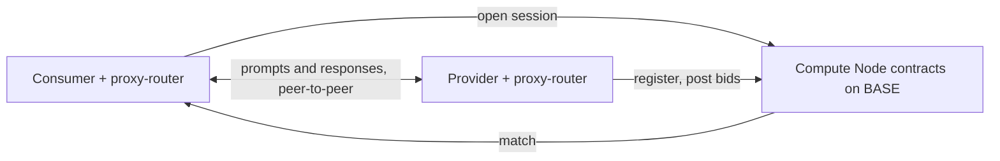

The **Morpheus Inference Marketplace** is where decentralized AI becomes accessible to everyone. It connects people who need compute power (consumers) with providers who supply it, all coordinated by smart contracts on BASE. Instead of a centralized service, requests and responses flow **directly** between consumer and provider in a peer-to-peer system.

The Morpheus Lumerin Node is the open-source software stack that **wires actual prompts and inference to that marketplace**. It is the missing piece between "there is a contract on chain" and "I am chatting with a model."

## Why decentralized inference matters

Decentralized inference breaks the dependency on centralized providers who control access, pricing, and availability of AI infrastructure. In a decentralized system:

- **Anyone can contribute** resources, and **anyone can use them** — an open, resilient, competitive market.
- **No single points of failure.** No one provider's outage takes the network down.
- **Costs stay fair** through transparent on-chain incentives, not vendor pricing power.
- **Innovation isn't gated** by the decisions of a few large players.

It's about shifting power from closed platforms to an open network where inference is a shared, community-driven resource.

## Design

At the centre of the marketplace are the **Compute Node contracts** (the Diamond marketplace on BASE). They:

- **Register** providers and the models they host.
- **Match** consumers with available providers.
- **Secure** connections through encryption and verifiable on-chain logic.

To participate, **both sides** run a **proxy-router** — a lightweight binary (this repo) that talks to the contracts and manages session lifecycle. Once a session is open, the consumer's prompts go directly to the provider's model and the responses come back the same way — **no middleman, no inference flowing through a Morpheus-operated server**.

## Three core ideas

<CardGroup cols={3}>
  <Card title="Peer-to-peer after match" icon="route">
    Once a session is open, prompts and responses go **directly** between consumer and provider — no Morpheus-operated server in the data path. The blockchain only sees session open / close / settle, never the inference itself.
  </Card>
  <Card title="Session-time pricing, not tokens" icon="hourglass">
    Pricing is **per-second of session time**, not per-token. Consumers stake MOR for a fixed duration; the MOR is escrowed and refunded on close (full refund on natural expiration; early close uses a 1-day timelock for part of the refund). See [Sessions: stake, close, claim](/concepts/sessions-stake-close-recover).
  </Card>
  <Card title="Reputation-weighted matching" icon="trophy">
    Providers with strong uptime, time-to-first-token, throughput, and success rate are matched more often by the consumer-side rating system. See [rating-config.json](/reference/rating-config) for how the weights work.
  </Card>
</CardGroup>

## What Morpheus is *not*

- **Not a hosted service.** There is no "Morpheus, Inc." running the inference. Providers are independent operators.
- **Not on-chain inference.** The blockchain coordinates the marketplace; it does not execute prompts.
- **Not a wallet.** MorpheusUI manages a key for convenience; the keys, ETH, and MOR are all standard ERC-20 / EOA primitives on BASE.
- **Not token-priced.** Pricing is denominated in **session time** (`pricePerSecond`), not tokens. Long contexts and short contexts cost the same per second.

## Two ways to use Morpheus

You can either **run a node** (peer-to-peer, self-custody, native to the marketplace) or **use the hosted API Gateway** (no node, simple API key).

| Path | What it gives you | When to pick it |
|------|-------------------|-----------------|
| **Run a node** (this repo) | Direct, self-custody, peer-to-peer access to the marketplace; full TEE chain available | You want self-custody, attestation, automation, or to be a provider |
| **Hosted Inference API** ([apidocs.mor.org](https://apidocs.mor.org)) | OpenAI-compatible API key against a hosted gateway; powers the Morpheus Chat App and lite clients | You just want to plug Morpheus into an OpenAI-compatible app or framework |

See [Inference API overview](/inference-api/overview) for the hosted path.

## Where Morpheus, NodeNeo, Everclaw, app.mor.org fit

| Surface | Audience | What it does |
|---------|----------|--------------|
| `app.mor.org` (Morpheus Chat App) | Consumers | Hosted chat UI; powered by the API Gateway |
| MorpheusUI (this repo) | Consumers + small providers | Local Electron desktop chat with self-custodial wallet |
| NodeNeo ([nodeneo.io](https://nodeneo.io)) | Consumers + prosumers | Cross-platform consumer experience |
| Everclaw ([everclaw.xyz](https://everclaw.xyz)) | Agent developers | Skill / SDK that talks to a local AI gateway backed by Morpheus |
| MyProvider ([myprovider.mor.org](https://myprovider.mor.org)) | Providers | Hosted operator GUI for provider node management |
| **Inference API Gateway** ([apidocs.mor.org](https://apidocs.mor.org)) | Developers / API users | Hosted, OpenAI-compatible inference gateway — separate product, no node required. See [Inference API overview](/inference-api/overview). |
| `tech.mor.org` | All | Calculators, status, sessions, throughput, TEE explainers |
| `active.mor.org` | All | Live network status, active models, active bids |
| `gitbook.mor.org` | All / agents | Broader Morpheus docs hub. Supports an `?ask=<question>` query mechanism for AI agents — see [llm-prompt-cheatsheet](/ai/llm-prompt-cheatsheet#dynamic-querying-of-the-broader-morpheus-docs). |

See [Ecosystem](/ecosystem/overview) for curated, mirrored summaries with attribution.

## Further reading (canonical, off-site)

- [Intro to Morpheus Compute Node](https://github.com/MorpheusAIs/Docs/blob/main/!KEYDOCS%20README%20FIRST!/Compute%20Providers/Compute%20Node/Intro%20to%20Morpheus%20Compute%20Node.md) — the upstream MorpheusAIs/Docs explainer of the Compute Node design.
- [Discord — #morpheus-compute-node](https://discord.com/channels/1151741790408429580/1167520834139738289) — community questions.
