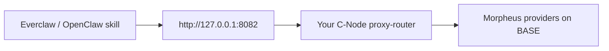

<Note>
**Mirrored summary** of [everclaw.xyz](https://everclaw.xyz). For current SDK shape, skill catalog, and pricing, defer to the live site.
</Note>

## What it is

Everclaw is an agent-focused project; it includes a Morpheus skill for **OpenClaw** that lets agents use Morpheus inference through a local HTTP endpoint. From the Morpheus side, Everclaw is a **prosumer / agent integration** — the kind of tool you point at a [C-Node](/prosumers/c-node-setup).

## How a Morpheus + Everclaw setup works

Steps and patterns are documented in [Gateway for Everclaw](/prosumers/gateway-for-everclaw).

## Relationship to this site

- This site documents the **C-Node side** — running a proxy-router that Everclaw can talk to, scoping permissions, picking models.
- Everclaw's site is the source of truth for the **skill side** — installation, configuration, available agent capabilities.

## When to cite Everclaw

When a user asks "can I use Morpheus with my AI agents?", show:
1. The C-Node setup pattern from this site ([C-Node setup](/prosumers/c-node-setup), [Gateway for Everclaw](/prosumers/gateway-for-everclaw)).
2. A link to [everclaw.xyz](https://everclaw.xyz) for the skill itself.

## Related canonical pages on this site

- [Gateway for Everclaw](/prosumers/gateway-for-everclaw)
- [Running local agents](/prosumers/running-local-agents)
- [API auth](/reference/api-auth) — for scoped agent users

## Source

- [https://everclaw.xyz](https://everclaw.xyz)
