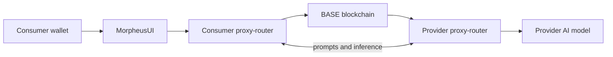

The Morpheus Lumerin Node is the open-source software that connects you to the **Morpheus Inference Marketplace** — a decentralized, peer-to-peer marketplace where consumers and independent providers trade AI inference, coordinated by smart contracts on BASE. You interact with it through a desktop chat experience, a CLI, or a direct HTTP API on your local node.

If you'd rather skip running a node entirely and use a simple OpenAI-compatible API key, see the **hosted [Morpheus Inference API](/inference-api/overview)** ([apidocs.mor.org](https://apidocs.mor.org)).

For the conceptual picture (decentralization rationale, Compute Node contracts, peer-to-peer routing, reputation system, session-time pricing), see [What is Morpheus?](/concepts/what-is-morpheus).

## What's in the box

<CardGroup cols={2}>
  <Card title="proxy-router" icon="route">
    Background process that listens to the BASE blockchain, manages secure consumer/provider sessions, and routes prompts and responses. The same binary serves both sides; only configuration differs.
  </Card>
  <Card title="MorpheusUI" icon="window">
    Electron desktop GUI that consumers use to browse bids, open sessions, and chat with models.
  </Card>
  <Card title="mor-cli" icon="terminal">
    Command-line client that talks to the proxy-router HTTP API.
  </Card>
  <Card title="llama.cpp + tinyllama" icon="microchip">
    A throw-away local model bundled for demos so you can try the stack without paying MOR.
  </Card>
</CardGroup>

## How the pieces talk

1. **Consumer** opens a session by staking MOR against a provider's bid on chain.
2. The **consumer proxy-router** opens a TCP connection to the **provider proxy-router** (port 3333 by default) and forwards prompts.
3. The **provider proxy-router** dispatches to the configured backend model (`apiUrl` in [`models-config.json`](/reference/models-config)) and streams the response back.
4. The **BASE blockchain** holds the source of truth for providers, models, bids, and sessions. MOR pays for usage; ETH on BASE pays for gas.

## Pick your role

<CardGroup cols={2}>
  <Card title="Hosted Inference API" icon="plug" href="/inference-api/overview">
    No node, no wallet — OpenAI-compatible API key.
  </Card>
  <Card title="Consumer quickstart" icon="user" href="/consumers/quickstart">
    Install the desktop release, fund a wallet, open a session, chat.
  </Card>
  <Card title="Provider quickstart" icon="server" href="/providers/full/quickstart">
    Stand up a proxy-router, register a model, post a bid.
  </Card>
  <Card title="TEE provider fast lane" icon="shield-check" href="/providers/full/secretvm-quickstart">
    Deploy a hardened `-tee` image on SecretVM in minutes.
  </Card>
  <Card title="Resale provider" icon="boxes-stacked" href="/providers/resale/overview">
    Resell Venice / OpenAI / Anthropic capacity on Morpheus.
  </Card>
</CardGroup>

## Networks and addresses

See [Networks & tokens](/get-started/networks-and-tokens) for the canonical, per-release MOR token, Diamond contract, and chain-ID values.
