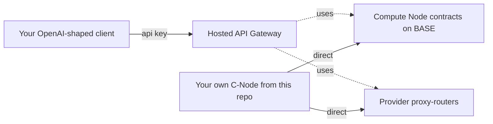

The **Morpheus Inference API** (also called the API Gateway) is a separate hosted product built on top of the Morpheus Inference Marketplace. It gives you OpenAI-compatible inference behind a simple base URL and API key — **no proxy-router, no wallet, no on-chain session management**. It powers integrations, lite clients, and the **Morpheus Chat App** at [app.mor.org](https://app.mor.org). Canonical docs at [apidocs.mor.org](https://apidocs.mor.org).

<Note>
This page summarizes the product. The canonical, full documentation lives at [apidocs.mor.org](https://apidocs.mor.org). For deeper integration guides (Cursor, OpenCode, LangChain, Eliza, n8n, Open Web-UI, Brave Leo, OpenAI Python SDK, Vercel AI SDK), follow the links there.
</Note>

## When to use the Inference API vs running a node

| You want to... | Use |
|----------------|-----|
| Plug Morpheus into an OpenAI-compatible client without managing infra | **Inference API** ([apidocs.mor.org](https://apidocs.mor.org)) |
| Self-custody your wallet and pay providers directly on-chain | [Run a C-Node](/prosumers/c-node-setup) or [MorpheusUI](/consumers/quickstart) |
| Host models for the marketplace and earn MOR | [Run a P-Node](/providers/full/quickstart) |
| Get cryptographic TEE attestation guarantees on the inference path | [TEE provider chain](/concepts/tee-overview) (requires running your own consumer-side proxy-router) |

The Inference API abstracts away node operation, sessions, and MOR escrow into a simple API-key model. Behind the scenes it talks to the same Morpheus marketplace this repo's proxy-router does.

## Quickstart

Per [apidocs.mor.org](https://apidocs.mor.org):

<Steps>
  <Step title="Sign up">
    Create an account at [app.mor.org](https://app.mor.org) and log in.
  </Step>
  <Step title="Get an API key">
    Generate an API key and confirm automation is enabled.
  </Step>
  <Step title="Try it">
    Either chat through the hosted **test** page, or start integrating immediately.
  </Step>
</Steps>

```
Inference API base URL:  https://api.mor.org/api/v1
```

## Using it with the OpenAI Python SDK

The Inference API speaks the OpenAI HTTP shape, so any OpenAI-compatible client works:

```python
from openai import OpenAI

client = OpenAI(
    base_url="https://api.mor.org/api/v1",
    api_key="<your_morpheus_api_key>",
)

response = client.chat.completions.create(
    model="<a-model-from-the-marketplace>",
    messages=[{"role": "user", "content": "Hello"}],
)
```

Same pattern for the Vercel AI SDK, LangChain, Eliza, n8n, Cursor, OpenCode, Open Web-UI, Brave Leo, etc. Specific integration guides for each: [apidocs.mor.org](https://apidocs.mor.org).

## What this product is *not*

- **Not the proxy-router HTTP API.** That's a different surface — a local API exposed by the [proxy-router](/concepts/architecture) on `:8082` when you self-host. If you're running a node, you talk to it directly; you do not use `api.mor.org` for that.
- **Not the only way to use Morpheus.** It's the easiest, but you give up self-custody of the wallet and direct on-chain control of sessions in exchange. Casual chat users with the same trade-off can use [app.mor.org](/ecosystem/app-mor-org) directly (no API integration needed).
- **Not the whole marketplace.** The list of models exposed through `apidocs.mor.org` / `app.mor.org` is the **bootstrap set** the gateway curated when the system launched — not every model on the marketplace. Independent providers can register additional models and bids on chain that won't appear in the gateway's catalog. To see the live full marketplace, query [active.mor.org/active_models.json](https://active.mor.org/active_models.json) and [active.mor.org/active_bids.json](https://active.mor.org/active_bids.json), or run your own proxy-router and use [`GET /blockchain/models`](/reference/api-endpoints#get-models).

## Pricing

The hosted API runs on a credits/billing model — see [apidocs.mor.org](https://apidocs.mor.org) for current terms. The underlying **marketplace** itself is priced per **session-time** (`pricePerSecond`), not per token — see [Tokens and fees](/concepts/tokens-and-fees).

## Relationship to this repository



The Inference API is built on the same Morpheus marketplace this repo's proxy-router talks to. If you want to **self-host** that gateway behavior (your own wallet, your own MOR, no third-party billing, full control), follow [C-Node setup](/prosumers/c-node-setup) and call your local proxy-router instead.

## Related

- [What is Morpheus?](/concepts/what-is-morpheus)
- [Architecture](/concepts/architecture)
- [Hosted consumer surface — app.mor.org / Morpheus Chat App](/ecosystem/app-mor-org)
- [Self-hosted consumer alternative — C-Node setup](/prosumers/c-node-setup)
