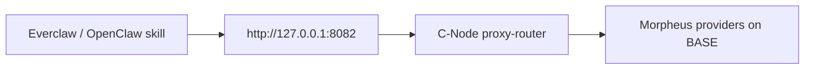

[Everclaw](https://everclaw.xyz) is an agent-focused project; David's "Morpheus skill" for OpenClaw lets agents call Morpheus inference via a local HTTP endpoint. You provide the endpoint by running a [C-Node](/prosumers/c-node-setup) on the same machine.

<Note>
This page is a **mirror summary**, last verified for v7.0.0. For canonical Everclaw guidance, see [everclaw.xyz](https://everclaw.xyz).
</Note>

## Pattern



The skill thinks it's calling a local OpenAI-compatible API. The C-Node handles wallets, sessions, and routing on the back end.

## Setup steps

<Steps>
  <Step title="Run a C-Node">
    Follow [C-Node setup](/prosumers/c-node-setup). Bind `:8082` to loopback only.
  </Step>
  <Step title="Approve some MOR allowance once">
    See "Approve once" in [C-Node setup](/prosumers/c-node-setup#approve-once).
  </Step>
  <Step title="Pre-open a session (optional)">
    Some agent skills want a stable session for the run. Open one and pass the `sessionId` to the skill via env var.
    ```bash
    SESSION=$(curl -s -X POST \
      'http://127.0.0.1:8082/blockchain/models/<modelId>/session' \
      -H 'Authorization: Basic <base64(user:pass)>' \
      -H 'Content-Type: application/json' \
      -d '{"sessionDuration": 3600}' | jq -r .sessionId)
    echo $SESSION
    ```
  </Step>
  <Step title="Configure the skill">
    Set the skill's OpenAI-base-URL to `http://127.0.0.1:8082` and inject `Authorization: Basic <base64(user:pass)>` and `session_id: <sessionId>` headers per request. See your skill's docs for the exact env names.
  </Step>
  <Step title="Validate">
    Run a sample task in the skill and watch the C-Node logs. You should see prompts being forwarded and the session metering correctly.
  </Step>
</Steps>

## Permissions

Run agents under a **separate `proxy.conf` user** with a method whitelist. For an Everclaw skill that only needs chat completions plus session lifecycle:

```
rpcauth=agent:<salt>$<hash>
rpcwhitelist=agent:chat,open_session,close_session,get_balance
rpcwhitelistdefault=0
```

See [API auth](/reference/api-auth) for the full method list.

## Failure modes to plan for

- **Provider unreachable** — agent should retry, then the C-Node closes the stuck session and returns the unused MOR.
- **Session expired mid-task** — agent should detect 401/403/429 from the C-Node and re-open a session.
- **Allowance exhausted** — `approve` more MOR (see C-Node setup) or set up a top-up cron.

## Related

- [Everclaw ecosystem mirror](/ecosystem/everclaw) — broader context, links.
- [Running local agents](/prosumers/running-local-agents) — generalized agent patterns.
