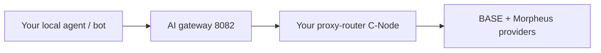

A **prosumer** sits between a casual consumer (using `app.mor.org` or MorpheusUI) and a full provider. You run your own **C-Node** (consumer-side proxy-router) and you typically host a small **AI gateway** so other tools — Everclaw skills, local agents, automation — can hit Morpheus through a single local endpoint with predictable auth.

## Topology

## Why prosumer?

- **One stable endpoint** for all your local agents to point at — no per-tool wallet juggling.
- **Bring your own wallet** with a real budget; agents can't drain it without your permission (see [API auth](/reference/api-auth) per-user whitelists).
- **Mix local + remote** — fall back to bundled `llama.cpp` for free smoke tests; switch to remote Morpheus models for production tasks.
- **TEE on demand** — when an agent needs higher trust, route through a `tee`-tagged model.

## What's on this path

<CardGroup cols={2}>
  <Card title="C-Node setup" icon="laptop" href="/prosumers/c-node-setup">
    Consumer-side proxy-router with persistent local API.
  </Card>
  <Card title="Gateway for Everclaw" icon="plug" href="/prosumers/gateway-for-everclaw">
    Wire Everclaw / OpenClaw skills to your local C-Node.
  </Card>
  <Card title="Running local agents" icon="robot" href="/prosumers/running-local-agents">
    BasicAuth + per-agent permission whitelists for safe automation.
  </Card>
  <Card title="API auth" icon="key" href="/reference/api-auth">
    `proxy.conf`, rpcauth/rpcwhitelist, multi-user setup.
  </Card>
</CardGroup>
