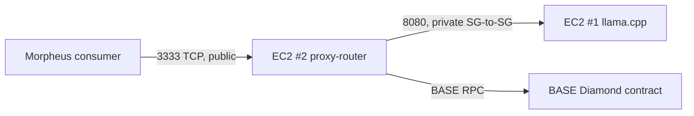

This guide walks through running a Morpheus provider entirely on AWS — one EC2 instance hosting an LLM via `llama.cpp`, a second EC2 instance running the proxy-router. The two-instance split is recommended for separation of concerns; you can also collapse them onto one instance for cost.

<Note>
The original draft of this guide was written when Morpheus was testnet-only. The instructions still work; updated cross-references in this page reflect the current mainnet-default release.
</Note>

For non-AWS alternatives, see [Docker](/providers/full/proxy-router-docker), [Akash](/providers/full/proxy-router-akash), or [SecretVM (TEE)](/providers/full/secretvm-quickstart).

## Architecture



## Part 1 — LLM EC2 instance

<Steps>
  <Step title="Launch an EC2 instance for the model">
    1. Sign in to AWS and open the EC2 dashboard.
    2. **Launch instances**.
    3. Name it (e.g. `morpheus-llm`) and choose **Amazon Linux**.
    4. **Instance type — this directly determines which model you can run.** TinyLlama works on `m5.xlarge`; production models need GPU instances (`g5.xlarge`+ for 7-13B; `g5.12xlarge`+ for 70B).
    5. Pick or create a **key pair**.
    6. **Security group** — open inbound TCP `8080` (the model HTTP port) **only from the proxy-router instance's security group**, plus port `22` from your IP for SSH. Don't expose `8080` to the world.
    7. Configure **storage** generously — model weights are large (a 7B Q4_K_M GGUF is ~4 GB; a 70B model is ~40 GB).
    8. **Launch**, then **Connect → EC2 Instance Connect**.
  </Step>
  <Step title="Install dependencies">
    ```bash
    sudo yum install git -y
    sudo yum install golang-go -y
    sudo yum groupinstall "Development Tools" -y
    ```
  </Step>
  <Step title="Build llama.cpp">
    ```bash
    git clone https://github.com/ggerganov/llama.cpp.git
    cd llama.cpp
    make -j 8
    ```
  </Step>
  <Step title="Download a model and start the server">
    Use the EC2 instance's **public IPv4 DNS** as `model_host`. Pick a GGUF model from HuggingFace (TinyLlama is the smallest, used here for smoke-testing only — it's not a real production model).

    ```bash
    model_host=<your-ec2-public-dns>
    model_port=8080
    model_url=https://huggingface.co/TheBloke
    model_collection=TinyLlama-1.1B-Chat-v1.0-GGUF
    model_file_name=tinyllama-1.1b-chat-v1.0.Q4_K_M.gguf

    wget -O models/${model_file_name} \
      ${model_url}/${model_collection}/resolve/main/${model_file_name}

    ./llama-server -m models/${model_file_name} \
      --host 0.0.0.0 \
      --port ${model_port} \
      --n-gpu-layers 4096
    ```

    For a real production deployment use a properly sized model and consider [vLLM](https://github.com/vllm-project/vllm) or another GPU-optimized server. See [Model setup](/providers/full/model-setup) for backend options.
  </Step>
  <Step title="Validate the model is reachable">
    From a browser: `http://<model_host>:<model_port>` should show the llama.cpp UI. From the proxy-router instance: `curl http://<model_host>:<model_port>/v1/chat/completions ...` should respond.
  </Step>
</Steps>

## Part 2 — Proxy-router EC2 instance

<Steps>
  <Step title="Launch a second EC2 instance">
    Same steps as above, but a small instance type is fine (`t3.small` works for the proxy-router itself). Name it (e.g. `morpheus-proxy-router`).

    **Security group** — inbound:
    - TCP `3333` from `0.0.0.0/0` (this is the public consumer endpoint).
    - TCP `8082` from your operator IPs only (admin/Swagger).
    - TCP `22` from your IP (SSH).

    Allow this instance's SG to reach the LLM instance's SG on port `8080`.
  </Step>
  <Step title="Install dependencies">
    ```bash
    sudo yum install git -y
    sudo yum install golang-go -y
    sudo yum groupinstall "Development Tools" -y
    ```
  </Step>
  <Step title="Clone and configure">
    ```bash
    git clone https://github.com/MorpheusAIs/Morpheus-Lumerin-Node.git
    cd Morpheus-Lumerin-Node/proxy-router
    cp .env.example .env
    vi .env
    ```
    Set:
    - `WALLET_PRIVATE_KEY` — your provider wallet's private key.
    - `ETH_NODE_ADDRESS` — your BASE RPC URL (e.g. Alchemy `wss://base-mainnet.g.alchemy.com/v2/<key>` or HTTPS).
    - `WEB_ADDRESS=0.0.0.0:8082`
    - `WEB_PUBLIC_URL=http://<proxy-router-public-dns>:8082`
    - `PROXY_ADDRESS=0.0.0.0:3333`

    Then update [`models-config.json`](/reference/models-config) so the proxy-router routes to your LLM instance:
    ```json
    {
      "models": [{
        "modelId": "0x<your_chain_modelId>",
        "modelName": "tinyllama",
        "apiType": "openai",
        "apiUrl": "http://<llm-instance-private-dns>:8080/v1/chat/completions"
      }]
    }
    ```

    Full env reference: [Env: proxy-router](/reference/env-proxy-router).
  </Step>
  <Step title="Build and run">
    ```bash
    ./build.sh
    make run
    ```
    Logs should show:
    ```
    INFO  proxy state: running
    INFO  HTTP  http server is listening: 0.0.0.0:8082
    INFO  TCP   tcp server is listening: 0.0.0.0:3333
    ```
    For long-lived operation, run it under `systemd` — see [Headless operation](/providers/full/headless).
  </Step>
  <Step title="Validate">
    Open `http://<web_public_url>/swagger/index.html` to confirm the API is up.
  </Step>
</Steps>

## Part 3 — Register on chain

Now register your provider, model, and bid following [Register on chain](/providers/full/register-onchain). The provider `endpoint` you set there must be reachable from the public internet on `:3333` — i.e. `<proxy-router-public-dns>:3333`.

## Operational notes

- **Costs.** Production providers usually pair a GPU instance (`g5.*`, `g6.*`) for the LLM with a small `t3.*` for the proxy-router. Watch egress charges — heavy session traffic adds up.
- **Public IP stability.** EC2 public DNS changes when an instance stops/starts. Use an **Elastic IP** on the proxy-router instance, or a stable DNS name (Route 53), so your registered provider `endpoint` keeps working across reboots.
- **Security groups.** Never expose port `8080` (LLM) or `8082` (admin API) to `0.0.0.0/0`. Only `3333` is meant to be public.
- **TLS for `:8082`.** Put a reverse proxy (nginx, Caddy, ALB) in front of `:8082` if operators need to reach it from outside the VPC. See [Headless operation](/providers/full/headless).

## TEE (optional)

For a TEE-attested provider, AWS EC2 alone is not enough — you need a confidential VM (Intel TDX or AMD SEV-SNP) and a hardened image. Use [SecretVM](/providers/full/secretvm-quickstart) instead of bare EC2.

## Related

- [Docker provider](/providers/full/proxy-router-docker)
- [Akash provider](/providers/full/proxy-router-akash)
- [SecretVM TEE provider](/providers/full/secretvm-quickstart)
- [Headless operation](/providers/full/headless)
- [Register on chain](/providers/full/register-onchain)
