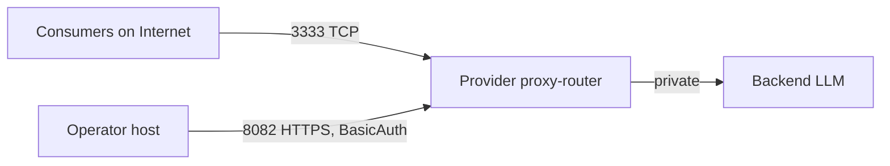

A "headless" provider is the proxy-router binary running as a long-lived service — no MorpheusUI, no human at a keyboard. This is the typical production deployment.

## Topology



- **`:3333` (TCP)** — public. Consumers connect here.
- **`:8082` (HTTP)** — should be **firewalled to operator IPs only**, ideally behind a reverse proxy with TLS. Used for Swagger, blockchain admin, and the auth APIs.
- **Backend LLM** — private network only.

## Service supervision

<Tabs>
  <Tab title="systemd (Linux)">
    Create `/etc/systemd/system/morpheus-proxy-router.service`:
    ```ini
    [Unit]
    Description=Morpheus Lumerin proxy-router
    After=network-online.target
    Wants=network-online.target

    [Service]
    User=morpheus
    WorkingDirectory=/opt/morpheus
    EnvironmentFile=/opt/morpheus/.env
    ExecStart=/opt/morpheus/proxy-router
    Restart=on-failure
    RestartSec=5
    LimitNOFILE=65536

    [Install]
    WantedBy=multi-user.target
    ```
    ```bash
    sudo systemctl enable --now morpheus-proxy-router
    sudo journalctl -u morpheus-proxy-router -f
    ```
  </Tab>
  <Tab title="Docker / Compose">
    See [Docker provider](/providers/full/proxy-router-docker) and use the published `ghcr.io/morpheusais/morpheus-lumerin-node:latest` image with `restart: unless-stopped`.
  </Tab>
  <Tab title="SecretVM (TEE)">
    For TEE-hardened headless operation, use SecretVM — see [SecretVM quickstart](/providers/full/secretvm-quickstart). The container is automatically supervised by the VM.
  </Tab>
</Tabs>

## API auth

Set strong credentials in the `.cookie` file (or `COOKIE_CONTENT` env in TEE/Akash deployments). For multi-user access (e.g. `agent` accounts with restricted whitelists), see [API auth](/reference/api-auth).

## Logging & observability

- Container logs (`docker logs`) or `journalctl` for systemd. Set `ENVIRONMENT=production` and `LOG_JSON=true` for structured logs in production.
- The `./data/` directory persists Badger state and runtime files — back this up.
- `GET /healthcheck` for liveness; `GET /v1/models/attestation` for TEE per-model state.

## Wallet hygiene

- Use a **dedicated provider wallet**, never the same key as your personal MetaMask.
- Rotate periodically: register a new provider record with the new key and decommission the old one.
- For TEE deployments the key is encrypted into the enclave secrets; for non-TEE keep the key inside `.env` with strict file permissions (`chmod 600`).

## Updating

When a new release ships:

1. Stop the service.
2. Replace the binary or image tag.
3. Start the service.
4. Confirm `/healthcheck` and Swagger respond. Confirm the proxy-router log shows the expected version.
5. (TEE) Update the deployed compose with the new digest and re-verify attestation.
