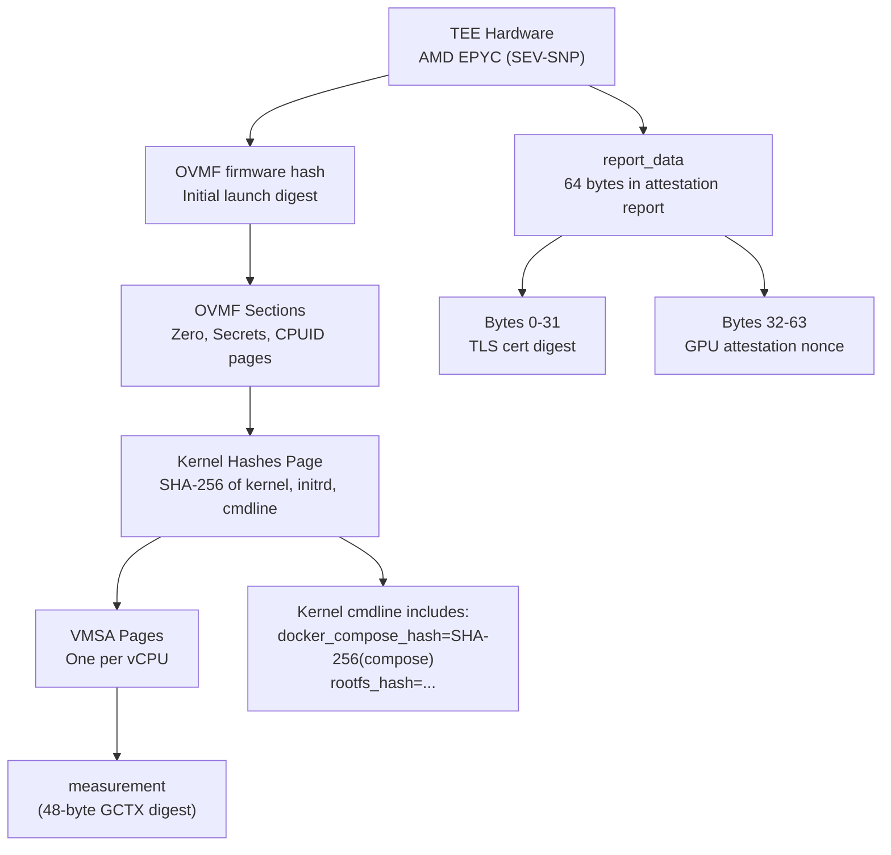

The proxy-router supports two TEE platforms for [Phase 2 backend attestation](/providers/full/tee-backend-verification): **Intel TDX** and **AMD SEV-SNP**. This page describes the SEV-SNP verification flow and highlights the differences from TDX.

Both platforms share the same high-level attestation pipeline (CPU quote fetch, portal verification, TLS binding, workload verification, GPU binding), but differ in quote encoding, portal endpoints, report structure, registry format, and measurement computation.

## Key differences: SEV vs TDX

| Aspect | Intel TDX | AMD SEV-SNP |
|--------|-----------|-------------|
| Quote encoding | Hex-encoded | Base64-encoded |
| Portal endpoint | `/api/quote-parse` | `/api/quote-parse-sev` |
| Report data format | Contiguous hex string | Space-separated hex bytes |
| Measurement model | RTMR extend chain (SHA-384) | GCTX launch digest (SHA-384 page hashing) |
| What is measured | MRTD + RTMR0-3 (firmware, config, kernel, initrd, workload) | Single `measurement` field (GCTX digest covering OVMF, kernel hashes page, VMSA pages) |
| Artifact registry | CSV format, keyed by MRTD + RTMR0-2 | JSON format, keyed by vm_type + artifacts_ver |
| Registry URL | `artifacts_registry/tdx.csv` | `artifacts_registry/sev.json` |
| Workload binding | RTMR3 = SHA-384 extend of (compose_hash, rootfs_data) | GCTX digest embeds kernel cmdline containing `docker_compose_hash` and `rootfs_hash` |
| VM identity fields | MRTD, RTMR0-3 in quote fields | `family_id` (0x010) and `image_id` (0x020) in report body |
| vCPU configuration | Not part of measurement | VMSA pages hashed per-vCPU into GCTX digest |

## Quote detection

The system auto-detects the quote type when it arrives from the backend's `/cpu` endpoint:

1. Try hex-decoding the raw text. If it succeeds and the first 8 bytes match the TDX header (version=4, tee_type=0x81), it is **TDX**.
2. Otherwise, treat as **SEV-SNP** (base64-encoded).

This detection happens in `VerifyQuote()` via `IsTdxQuote()` and determines which portal endpoint to use.

## SEV attestation flow

The overall `AttestBackend` pipeline is identical for both TEE types. The differences are in the details of each step:

```mermaid
sequenceDiagram
    participant P as Proxy-Router
    participant B as Backend SecretVM
    participant S as SecretAI Portal
    participant R as SEV Registry
    participant N as NVIDIA NRAS

    P->>B: GET :21434/cpu
    B-->>P: CPU quote (base64)

    Note over P: IsTdxQuote() = false<br/>Route to /api/quote-parse-sev

    P->>S: POST /api/quote-parse-sev
    S-->>P: Verification result + report fields

    Note over P: Normalize report_data<br/>(strip spaces from hex bytes)<br/>Compare first 32 bytes with<br/>TLS cert digest (SPKI or full cert)

    alt SEV Registry loaded
        P->>B: GET :21434/docker-compose
        B-->>P: docker-compose.yaml

        Note over P: Base64-decode quote<br/>Extract measurement (0x090, 48 bytes)<br/>Extract family_id (0x010, 16 bytes)<br/>Extract image_id (0x020, 16 bytes)

        P->>R: Lookup by family_id vm_type
        R-->>P: Matching SEV registry entries

        Note over P: For each entry:<br/>Build cmdline with compose hash<br/>Compute GCTX launch digest<br/>Compare vs quote measurement
    end

    P->>B: GET :21434/gpu
    B-->>P: GPU attestation JSON

    Note over P: Normalize report_data<br/>(strip spaces)<br/>Verify bytes 32-63 == GPU nonce

    P->>N: POST /v4/attest/gpu
    N-->>P: JWT attestation token
```



### Step-by-step details

#### 1. CPU quote fetch and portal verification

The backend returns a **base64-encoded** SEV-SNP attestation report from the attestation endpoint's `/cpu`. The proxy-router detects this is not a TDX quote and routes it to the SEV-specific portal endpoint (`/api/quote-parse-sev`).

The portal returns the parsed report fields, including `report_data` and `measurement`. Unlike TDX, the SEV portal returns `report_data` as **space-separated hex bytes** (e.g., `"3b 7e ff 4e ..."`). The proxy-router normalizes this by stripping spaces before performing TLS and GPU binding checks.

#### 2. TLS binding

Identical to TDX: the first 32 bytes of `report_data` must match a SHA-256 digest of the TLS certificate presented by the attestation endpoint (`:21434`, falling back to `:29343`) — either the SPKI digest (current SecretVMs) or the full-certificate digest (legacy). The normalization step (stripping spaces from SEV's report_data format) is transparent to this check.

#### 3. Workload verification

This is where SEV differs most significantly from TDX:

**TDX workload verification** uses a simple RTMR3 extend chain:
- Look up MRTD + RTMR0-2 in the TDX CSV registry to identify the VM build.
- Recalculate RTMR3 by SHA-384-extending `SHA-256(docker-compose.yaml)` and `rootfs_data`.
- Compare the calculated RTMR3 against the quote's RTMR3.

**SEV workload verification** recomputes the entire GCTX launch digest:
- Parse the base64 quote to extract `measurement` (48 bytes at offset 0x090), `family_id` (16 bytes at 0x010), and `image_id` (16 bytes at 0x020).
- Parse `family_id` to determine vm_type, template name, and vCPU count.
- Look up matching entries in the SEV JSON registry.
- For each candidate entry, compute the expected GCTX launch digest by:
  1. Starting from the entry's `ovmf_hash` (SHA-384 of the OVMF firmware).
  2. Processing each OVMF section (zero pages, secrets page, CPUID page, kernel hashes page).
  3. Building the kernel hashes page from `kernel_hash`, `initrd_hash`, and the kernel cmdline (which includes `docker_compose_hash=SHA-256(compose)` and `rootfs_hash`).
  4. Hashing one VMSA page per vCPU (BSP uses EIP=0xFFFFFFF0, APs use `sev_es_reset_eip` from the registry).
- Compare the computed digest against the quote's `measurement`.

Both the raw `/docker-compose` response and its HTML-extracted form are tried as compose-hash candidates, so old (HTML-wrapping) and new (raw-serving) attest-rest versions both verify.

#### 4. GPU binding

Identical to TDX: the second 32 bytes of `report_data` must match the GPU attestation nonce. The same space-stripping normalization applies.

#### 5. NRAS verification

Identical to TDX — mandatory, and a failed or unreachable NRAS fails the attestation.

## SEV trust chain

The SEV trust chain is fundamentally different from TDX. Instead of separate measurement registers (MRTD, RTMR0-3), SEV uses a single cumulative launch digest that covers all measured components.



### SEV report fields used

| Field | Offset | Size | Purpose |
|-------|--------|------|---------|
| `measurement` | 0x090 | 48 bytes | GCTX launch digest (SHA-384) |
| `family_id` | 0x010 | 16 bytes | VM type + template (e.g., `prod-small-sev`) |
| `image_id` | 0x020 | 16 bytes | Artifacts version string |
| `report_data` | (from portal) | 64 bytes | TLS digest (first 32) + GPU nonce (second 32) |

### GCTX launch digest computation

The GCTX digest is computed as a chain of SHA-384 hashes over 0x70-byte PAGE_INFO structures (AMD SNP spec Section 8.17.2):

```
digest = ovmf_hash
for each OVMF section:
    digest = SHA-384(digest || page_content_hash || page_type || gpa)
for each vCPU:
    vmsa = build_vmsa_page(eip, vcpu_sig, guest_features)
    digest = SHA-384(digest || SHA-384(vmsa) || VMSA_page_type || VMSA_GPA)
```

The kernel hashes page is a special OVMF section (type 0x10) that contains a GUID-indexed table with SHA-256 hashes of:
- Kernel command line (includes `docker_compose_hash` and `rootfs_hash`)
- Initrd
- Kernel

This is how the docker-compose content gets measured into the SEV launch digest — through the kernel cmdline parameter `docker_compose_hash=<SHA-256 of docker-compose.yaml>`.

## SEV artifact registry

The SEV registry is a JSON array at [sev.json](https://github.com/scrtlabs/secretvm-verify/blob/main/artifacts_registry/sev.json). Each entry contains all the data needed to recompute the GCTX launch digest:

| Field | Description |
|-------|-------------|
| `vm_type` | Environment: `prod`, `dev`, `gpu_prod`, `gpu_dev` |
| `artifacts_ver` | SecretVM version (e.g., `v0.0.33`) |
| `kernel_hash` | SHA-256 of the kernel image |
| `initrd_hash` | SHA-256 of the initrd image |
| `vcpu_type` | CPU type (always `EPYC`) |
| `rootfs_hash` | SHA-256 of the root filesystem |
| `ovmf_hash` | SHA-384 of the OVMF firmware (initial launch digest) |
| `sev_hashes_table_gpa` | Guest physical address of the kernel hashes table |
| `sev_es_reset_eip` | AP vCPU reset EIP address |
| `ovmf_sections` | Array of `{gpa, size, section_type}` for OVMF section processing |
| `cmdline_extra` | Optional extra kernel cmdline tokens (e.g., `pci=realloc,nocrs` for GPU VMs) |

### Template sizes

The `family_id` field encodes the VM template name, which maps to a vCPU count:

| Template | vCPUs |
|----------|-------|
| `small` | 1 |
| `medium` | 2 |
| `large` | 4 |
| `2xlarge` | 8 |
| `4xlarge` | 16 |

## Configuration

| Variable | Default | Description |
|----------|---------|-------------|
| `SEV_ARTIFACT_REGISTRY_URL` | [sev.json on GitHub](https://raw.githubusercontent.com/scrtlabs/secretvm-verify/main/artifacts_registry/sev.json) | URL for the SEV-SNP artifact registry JSON |
| `ARTIFACT_REGISTRY_REFRESH_INTERVAL` | `1h` | Shared refresh interval for both TDX and SEV registries |

## Code structure

All files live in `proxy-router/internal/attestation/`:

| File | Responsibility |
|------|---------------|
| `sev_gctx.go` | GCTX launch digest computation: page hashing, kernel hashes page, VMSA page construction, `CalcSevMeasurement`, `ParseSevFamilyID` |
| `sev_registry.go` | `SevArtifactRegistry`: fetches and caches the SEV JSON registry with periodic refresh |
| `sev_workload.go` | `VerifySevWorkload`: orchestrates SEV workload verification (quote parsing, registry lookup, measurement comparison) |
| `verifier.go` | `VerifyQuote` auto-detects TDX vs SEV and routes to the correct portal endpoint |
| `workload_verifier.go` | `VerifyWorkload` dispatches to `VerifyTdxWorkload` or `VerifySevWorkload` based on quote type |
