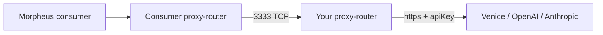

A "resale" provider runs a Morpheus proxy-router but does **not** host the model itself. The proxy-router forwards prompts to a hosted backend (Venice, OpenAI, Anthropic, Hyperbolic, etc.) using the backend's API key, and you collect MOR from the marketplace.

## Why resale

- You already pay for capacity at a hosted LLM provider that has spare headroom.
- You want exposure to MOR earnings without operating GPUs.
- You can stack on top of subscription plans (e.g. Venice Diem) and arbitrage between subscription cost and per-second MOR pricing.

## Why **not** resale

- You are bound by the upstream provider's TOS — many forbid resale; check first.
- Your margins depend on upstream pricing changes and rate limits.
- You cannot offer TEE attestation guarantees (see [TEE overview](/concepts/tee-overview)) because you do not control the backend.

## How it works mechanically

1. You run a normal proxy-router (containerized or bare-metal) — see [Container P-Node](/providers/resale/container-pnode).
2. In your `models-config.json` you set `apiUrl` to the upstream's chat completions endpoint and `apiKey` to your upstream account key.
3. You register your provider, model, and bid on chain — same as a standard full provider, just **without the `tee` tag**.
4. Consumer prompts arrive on `:3333`, get routed to your proxy-router on `:8082`, which forwards to the upstream `apiUrl`. Upstream responses stream back the same way.

## Things to watch for

<Warning>
**Upstream TOS.** Most commercial inference providers have explicit clauses about reselling. Read them. Reselling someone else's API in violation of their TOS is your risk, not Morpheus's.
</Warning>

- **Concurrency.** Set `concurrentSlots` in `models-config.json` to a value your upstream account actually supports — over-promising leads to dropped sessions and reputation damage.
- **Latency.** Resale adds two extra hops vs a colocated backend. Bid pricing should reflect this.
- **API compatibility.** The proxy-router speaks OpenAI-shaped requests; your upstream should as well. Mappings exist for Anthropic and Prodia. See [models-config.json](/reference/models-config).

## Next steps

<CardGroup cols={2}>
  <Card title="Container P-Node" icon="docker" href="/providers/resale/container-pnode">
    Stand up a proxy-router container.
  </Card>
  <Card title="Reselling Venice" icon="cloud" href="/providers/resale/reselling-venice">
    Concrete example: Venice Diem capacity.
  </Card>
  <Card title="Registering a bid" icon="gavel" href="/providers/resale/registering-bid">
    Bid pricing for resale economics.
  </Card>
  <Card title="On-chain registration" icon="link" href="/providers/full/register-onchain">
    Same flow as a full provider (without `tee`).
  </Card>
</CardGroup>
