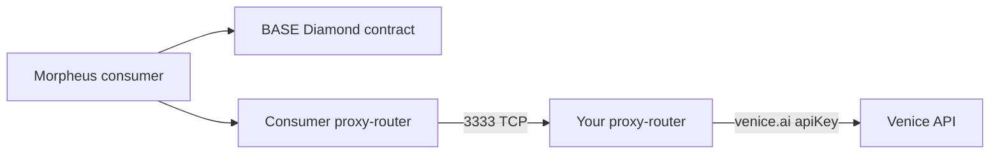

[Venice](https://venice.ai) sells subscription tiers (including the Diem tier) that include API access. If you have spare headroom in your Venice subscription, you can resell that capacity through Morpheus by configuring your proxy-router to forward to Venice's API.

<Warning>
**Read Venice's TOS.** Resale terms vary by tier and over time — confirm yours allows reselling API access before going live. This page describes mechanics, not legal permission.
</Warning>

## Architecture



## Steps

<Steps>
  <Step title="Get a Venice API key">
    Sign up at https://venice.ai and obtain an API key from your account dashboard. Confirm your tier supports the model you intend to resell at the concurrency you intend to advertise.
  </Step>
  <Step title="Pick the Venice models you'll resell">
    Examples: `text-embedding-bge-m3`, `tts-kokoro`, plus chat models supported by Venice. Check Venice's docs for the exact `apiUrl` per model.
  </Step>
  <Step title="Stand up the proxy-router container">
    Follow [Container P-Node](/providers/resale/container-pnode). Start the container; it will create `models-config.json` defaults you can edit.
  </Step>
  <Step title="Edit models-config.json">
    ```json
    {
      "$schema": "./internal/config/models-config-schema.json",
      "models": [
        {
          "modelId": "0x<your_chain_modelId_for_chat>",
          "modelName": "venice-chat",
          "apiType": "openai",
          "apiUrl": "https://api.venice.ai/api/v1/chat/completions",
          "apiKey": "<your_venice_api_key>",
          "concurrentSlots": 4,
          "capacityPolicy": "simple"
        },
        {
          "modelId": "0x<your_chain_modelId_for_embeddings>",
          "modelName": "text-embedding-bge-m3",
          "apiType": "openai",
          "apiUrl": "https://api.venice.ai/api/v1/embeddings",
          "apiKey": "<your_venice_api_key>"
        },
        {
          "modelId": "0x<your_chain_modelId_for_tts>",
          "modelName": "tts-kokoro",
          "apiType": "openai",
          "apiUrl": "https://api.venice.ai/api/v1/audio/speech",
          "apiKey": "<your_venice_api_key>"
        }
      ]
    }
    ```
    Restart the proxy-router after edits.
  </Step>
  <Step title="Register on chain">
    Same as a full provider, **without** the `tee` tag (you cannot attest Venice). Follow [Register on chain](/providers/full/register-onchain).
  </Step>
  <Step title="Pick a bid price">
    Lower is more attractive but you must clear your Venice cost. See [Registering a bid](/providers/resale/registering-bid) for the math.
  </Step>
  <Step title="Validate end-to-end">
    Open `http://your-host:8082/swagger/index.html`. From a separate consumer node, list models, open a session against your bid, and prompt. Watch your proxy-router logs and Venice usage dashboard simultaneously.
  </Step>
</Steps>

## Operational tips

- **Track Venice usage** — set Venice account limits/alerts so a session can't blow your budget.
- **Throttle `concurrentSlots`** — start conservatively. Going too high causes upstream 429s, which surface to consumers as a bad experience.
- **Failover**: if you maintain multiple upstream accounts, run multiple proxy-routers and post separate bids; consumers route to whichever is cheapest and healthy.
- **Avoid the `tee` tag** — you cannot prove anything about Venice's runtime. Only use `tee` when you control the backend on a SecretVM-style TEE.
