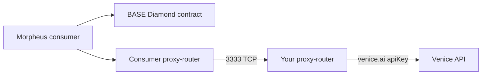

[Venice](https://venice.ai) subscription tiers (including **Diem**) include API access. If you have spare headroom, you can resell that capacity through Morpheus: your proxy-router forwards inference to Venice, and consumers pay you in MOR via marketplace bids.

The simplest path today is **MyProvider + an existing marketplace model Id** — not minting a new model for every Diem holder.

<Warning>
**Read Venice's TOS.** Resale terms vary by tier and over time — confirm yours allows reselling API access before going live. This page describes mechanics, not legal permission.
</Warning>

## Why this path

| Goal | Approach |
|------|----------|
| Earn MOR from unused Venice quota | Bid on an existing Morpheus model that matches what Venice can serve |
| Avoid marketplace clutter | Do **not** register a new model if one already exists on [active.mor.org](https://active.mor.org/status) |
| Stay graphical | Use [MyProvider](https://myprovider.mor.org) onboarding → **Venice Diem resale** path |
| Keep ops cheap | Docker/binary P-Node (or SecretVM if you want TEE for the *router* only — you still cannot tag Venice backends `tee`) |

## Architecture


```mermaid
flowchart LR
  Consumer[Morpheus consumer] --> Marketplace[BASE Diamond contract]
  Consumer --> CRouter[Consumer proxy-router]
  CRouter -->|"3333 TCP"| YourProxy[Your proxy-router]
  YourProxy -->|"venice.ai apiKey"| Venice[Venice API]
```

## Simple recipe (MyProvider-first)

<Steps>
  <Step title="Open MyProvider onboarding">
    Go to [myprovider.mor.org](https://myprovider.mor.org). Choose **Venice Diem resale** in **New provider onboarding**.
  </Step>
  <Step title="Look up the model to join">
    Search [active.mor.org](https://active.mor.org/status) (built into the wizard) for a model name Venice can serve. Copy the existing `Id`. Prefer bidding on that Id over creating a new model.
  </Step>
  <Step title="Fill Venice backend + secrets">
    Pick a Venice preset (chat / embeddings / TTS), paste your Venice API key, and export `MODELS_CONFIG_CONTENT` (and the rest of your `.env` / container secrets). Details also in [MyProvider GUI](/providers/full/myprovider-gui).
  </Step>
  <Step title="Run a proxy-router">
    Docker or binary is enough — see [Container P-Node](/providers/resale/container-pnode). Point `models-config` / `MODELS_CONFIG_CONTENT` at Venice URLs with your key. Expose `:3333` publicly; keep admin private (or HTTPS for hosted MyProvider).
  </Step>
  <Step title="Register provider + bid">
    Connect MyProvider to your node → **Provider** tab → register `host:3333`. **Models & Bids → Available Models → Add Bid** on the Id from step 2. Do **not** use the `tee` tag.
  </Step>
  <Step title="Price above your Venice cost">
    See [Pricing a resale bid](/providers/resale/registering-bid). Every bid costs a non-refundable `0.3 MOR` fee — finish config before posting.
  </Step>
  <Step title="Verify">
    Follow [Verify your provider setup](/providers/full/verify-setup). Watch Venice usage limits so a busy session cannot blow your Diem quota.
  </Step>
</Steps>

## Manual models-config (reference)

If you prefer editing JSON by hand:

```json
{
  "$schema": "./internal/config/models-config-schema.json",
  "models": [
    {
      "modelId": "0x<existing_active_mor_org_model_Id>",
      "modelName": "matching-on-chain-name",
      "apiType": "openai",
      "apiUrl": "https://api.venice.ai/api/v1/chat/completions",
      "apiKey": "<your_venice_api_key>",
      "concurrentSlots": 4,
      "capacityPolicy": "simple"
    }
  ]
}
```

Restart the proxy-router after edits. Full register/bid contract steps: [Register on chain](/providers/full/register-onchain).

## Operational tips

- **Track Venice usage** — set Venice account limits/alerts so a session can't blow your budget.
- **Throttle `concurrentSlots`** — start conservatively. Going too high causes upstream 429s.
- **Failover**: multiple upstream accounts → multiple proxy-routers and separate bids.
- **Avoid the `tee` tag** — you cannot prove anything about Venice's runtime. Only use `tee` when you control the backend on a SecretVM-style TEE.

## Related

- [MyProvider GUI](/providers/full/myprovider-gui)
- [Resale overview](/providers/resale/overview)
- [Register on chain](/providers/full/register-onchain)
- [active.mor.org](/ecosystem/active-status)
