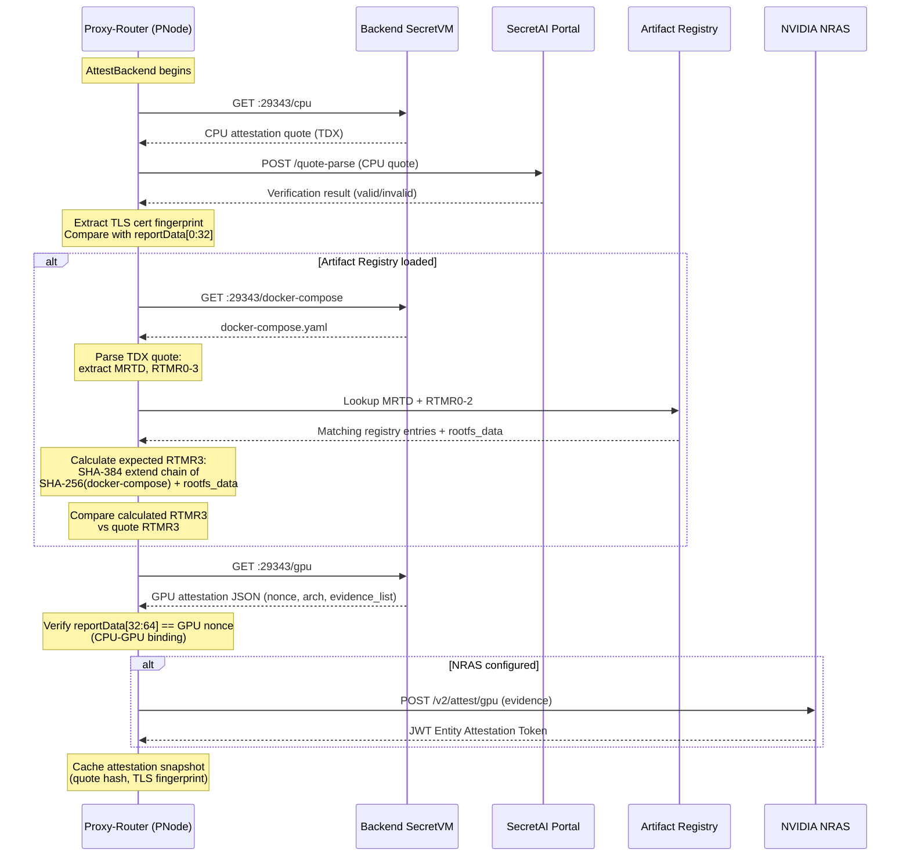
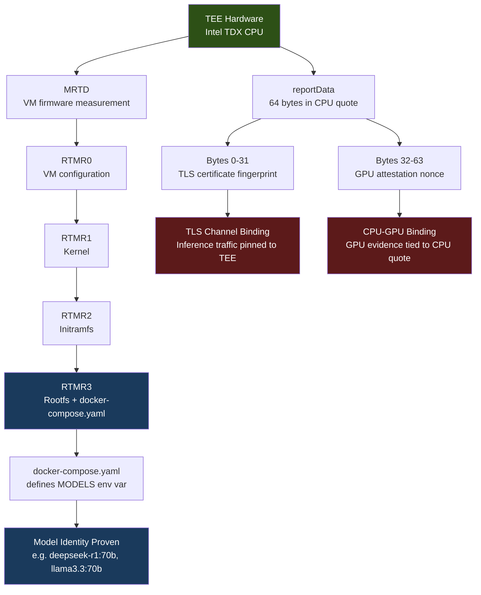
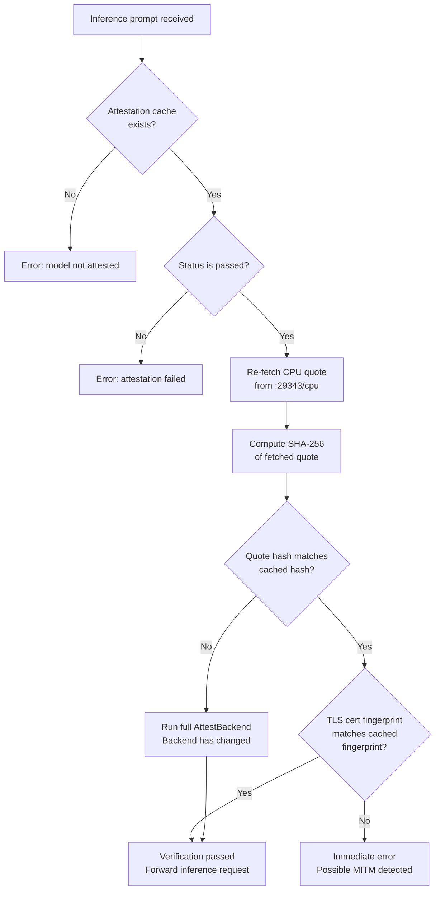

# TEE Backend Verification (Phase 2)

## Where this fits in the trust chain

Morpheus TEE trust is a **two-hop chain**:

```
C-Node (v6.0.0+) ──── Phase 1 ────▶ P-Node -tee image (v7.0.0+) ──── Phase 2 ────▶ Backend LLM (SecretVM)
                      (consumer                                      (this document)
                       verifies                                       P-Node verifies
                       P-Node)                                        its own backend
```

This document describes **Phase 2 only** — the verification performed **by the P-Node** (the provider's proxy-router running inside its own TEE) **against its backend LLM**. Phase 1 (consumer verifying the P-Node) is documented in [`docs/02.3-proxy-router-tee.md`](../../docs/02.3-proxy-router-tee.md).

Phase 2 is entirely self-contained inside the P-Node: the consumer never talks to the backend LLM directly and never sees the backend's attestation quote. The consumer trusts Phase 2 transitively, because it has already attested (in Phase 1) that the P-Node is running the exact `-tee` binary that implements Phase 2 faithfully. This is why **a v6.0.0+ consumer paired with a v7.0.0+ provider gains all Phase 2 guarantees without any client-side change**.

## Overview

The Phase 2 Backend Verification system provides cryptographic proof that AI inference requests forwarded by this P-Node are processed inside authentic, unmodified SecretVM instances running on genuine Intel TDX and NVIDIA GPU hardware. It operates in two modes:

- **Full attestation** (`AttestBackend`) runs at startup and whenever the fast verify detects a backend change. It performs end-to-end cryptographic verification of the backend's CPU TEE quote, GPU attestation evidence, workload integrity, and TLS binding.
- **Fast verification** (`FastVerifyBackend`) runs on every inference prompt. It always re-fetches the CPU quote and compares its hash and TLS fingerprint against the cached attestation snapshot. If the quote changes, it triggers full re-attestation. There is no TTL -- the fast check runs on every request unconditionally.

Together, these ensure that every inference request forwarded by this P-Node reaches a verified, tamper-proof backend -- from the hardware root of trust down to the specific AI models loaded inside the TEE.

## Security Guarantees

The verification system proves the following properties:

- **Hardware authenticity** -- The backend runs inside a genuine Intel TDX confidential VM with a hardware-signed attestation quote that chains back to Intel's root of trust.
- **Firmware and OS integrity** -- The measured boot chain (MRTD, RTMR0-2) matches entries in the SecretVM artifact registry, confirming the VM runs an authentic, unmodified SecretVM image.
- **Workload integrity** -- RTMR3 is recalculated from the backend's `docker-compose.yaml` and root filesystem data, proving the exact workload configuration running inside the TEE has not been altered.
- **Model identity** -- The `docker-compose.yaml` declares which AI models are loaded. Because RTMR3 covers this file byte-for-byte, swapping, adding, or removing any model changes the hash and fails verification.
- **TLS channel binding** -- The TLS certificate fingerprint is embedded in the CPU quote's `reportData`, binding the attested environment to a specific TLS identity. This prevents man-in-the-middle attacks: inference data can only reach the attested endpoint.
- **CPU-GPU binding** -- The GPU attestation nonce is embedded in the second half of the CPU `reportData`, cryptographically linking the GPU evidence to the same CPU TEE quote and preventing GPU attestation replay.
- **GPU hardware authenticity** -- GPU attestation evidence is independently verified by NVIDIA's Remote Attestation Service (NRAS), confirming the GPU hardware is genuine and uncompromised.
- **Continuous verification** -- Every inference prompt triggers a fast re-check of the backend's identity. TLS fingerprint or quote changes between attestations are detected immediately.

## Verification Checks

| # | Check | What It Proves | Failure Meaning |
|---|-------|---------------|-----------------|
| 1 | CPU quote fetch and portal verification | The backend runs in an Intel TDX TEE; the quote is cryptographically valid | Backend is not running in a TEE, or the quote is forged |
| 2 | TLS binding (reportData first 32 bytes = TLS cert fingerprint) | The TLS channel terminates inside the attested TEE | Possible MITM -- traffic may be intercepted before reaching the TEE |
| 3 | Workload verification -- MRTD + RTMR0-2 registry lookup | The VM firmware, config, kernel, and initramfs match a known SecretVM build | The VM image has been modified or is not an authentic SecretVM |
| 4 | Workload verification -- RTMR3 recalculation | The exact `docker-compose.yaml` and rootfs running inside the TEE match expectations | The workload has been tampered with (different models, altered config) |
| 5 | GPU attestation fetch | The backend exposes GPU attestation evidence | No GPU attestation available; GPU integrity unknown |
| 6 | CPU-GPU binding (reportData second 32 bytes = GPU nonce) | The GPU evidence was generated in the same session as the CPU quote | GPU attestation may be replayed from a different machine |
| 7 | NVIDIA NRAS verification | NVIDIA independently confirms the GPU hardware and certificate chain | GPU hardware is not genuine, or evidence has been tampered with |
| 8 | Per-prompt fast verify (always re-fetches /cpu, compares quote hash + TLS fingerprint) | The backend identity has not changed since initial attestation | The backend may have been restarted, replaced, or compromised |

## Full Attestation Flow

The `AttestBackend` method orchestrates the complete verification sequence at startup and whenever the fast verify detects a change in the backend's CPU quote.



### Step-by-Step

1. **Fetch CPU quote** -- The proxy-router requests the raw TDX attestation quote from the backend's attestation port (`:29343/cpu`).
2. **Verify CPU quote** -- The quote is sent to the SecretAI Portal's `quote-parse` API, which performs cryptographic verification against Intel's root of trust.
3. **TLS binding** -- The proxy-router extracts the TLS certificate fingerprint from the connection and compares it to the first 32 bytes of the quote's `reportData` field. A match proves the TLS endpoint is inside the attested TEE.
4. **Workload verification** (if artifact registry is loaded):
   - Fetch `docker-compose.yaml` from the backend.
   - Parse the TDX quote to extract measurement registers (MRTD, RTMR0-3).
   - Look up MRTD + RTMR0-2 in the artifact registry to confirm this is a recognized SecretVM build.
   - Recalculate the expected RTMR3 from `SHA-256(docker-compose.yaml)` combined with `rootfs_data` using a SHA-384 extend chain.
   - Compare the calculated RTMR3 against the quote's RTMR3 to prove workload integrity.
5. **Fetch GPU attestation** -- Retrieve GPU attestation data (JSON containing nonce, architecture, and evidence list) from `:29343/gpu`.
6. **CPU-GPU binding** -- Verify that the second 32 bytes of the CPU `reportData` match the GPU nonce, proving both attestations originate from the same machine and session.
7. **NRAS verification** (if configured) -- Submit GPU evidence to NVIDIA's Remote Attestation Service for independent hardware validation. NRAS returns a signed JWT (Entity Attestation Token) confirming GPU authenticity.
8. **Cache snapshot** -- Store the attestation result (quote hash, TLS fingerprint, workload status) for use by the fast verification path. The cache has no TTL -- it remains valid as long as the backend's CPU quote and TLS certificate haven't changed.

## Trust Chain

The TDX trust chain starts at the hardware and extends through each layer of the boot process up to the running workload.



### Measurement Registers

| Register | Contents | Verified By |
|----------|----------|-------------|
| MRTD | VM firmware hash (set at launch, immutable) | Artifact registry lookup |
| RTMR0 | VM configuration | Artifact registry lookup |
| RTMR1 | Kernel measurement | Artifact registry lookup |
| RTMR2 | Initramfs measurement | Artifact registry lookup |
| RTMR3 | Root filesystem + docker-compose.yaml | Recalculated and compared |

### reportData Layout

| Byte Range | Contents | Purpose |
|------------|----------|---------|
| 0 -- 31 | SHA-256 of TLS certificate | Binds attested TEE to a specific TLS identity |
| 32 -- 63 | GPU attestation nonce | Links GPU evidence to this CPU attestation |

## Per-Prompt Fast Verify

Every inference prompt for a TEE-marked model triggers `FastVerifyBackend` before the request is forwarded. This keeps verification latency low (approximately 50ms) while maintaining continuous assurance.



### Fast Verify Logic

There is no TTL or cache expiry. The fast verify runs the same check on every prompt unconditionally:

1. **Cache check** -- If no cached attestation exists (model was never attested), reject the request.
2. **Status check** -- If the cached status is `failed`, reject the request.
3. **Re-fetch CPU quote** -- Always request the current CPU quote from `:29343/cpu` (~50ms TLS handshake).
4. **Hash comparison** -- Compute `SHA-256` of the fetched quote and compare against the cached hash. A mismatch indicates the backend has changed (restart, redeployment) and triggers full re-attestation.
5. **TLS fingerprint comparison** -- Verify the current connection's TLS certificate fingerprint matches the cached value. A mismatch is treated as a critical error (possible MITM attack) and the request is rejected immediately.
6. **Pass** -- If both checks succeed, the inference request proceeds to the backend.

As long as the backend hasn't changed (same quote, same TLS cert), the fast path always passes without needing to re-run the expensive full attestation. Full re-attestation only triggers when something actually changes.

## Model Identity Guarantee

The `docker-compose.yaml` inside a SecretVM backend declares the AI models to be loaded via the `MODELS` environment variable:

```yaml
MODELS='deepseek-r1:70b gemma3:4b llama3.2-vision llama3.3:70b qwen3:8b'
```

RTMR3 is computed as a SHA-384 extend chain covering the root filesystem data and `SHA-256(docker-compose.yaml)`. This means:

- Changing any byte of `docker-compose.yaml` -- swapping `qwen3:8b` for a different model, altering a port binding, modifying an environment variable -- produces a different RTMR3 value.
- The TDX hardware enforces that measurement registers reflect the actual loaded software. Values cannot be faked or overridden from within the VM.
- The proxy-router independently recalculates the expected RTMR3 and compares it against the hardware-reported value. Any discrepancy fails verification.

This provides a cryptographic guarantee that the backend is running exactly the declared set of models, with no substitutions or additions.

## Configuration Reference

### Model Tagging (on-chain)

TEE verification is enabled **per-model on the blockchain**, not in the local `models-config.json`. When a model is registered in the Diamond contract with the `tee` tag (case-insensitive) in its `tags` array, the proxy-router automatically:

- On the **provider** side: performs full `AttestBackend` against that model's `apiUrl` host at startup, and runs `FastVerifyBackend` on every inference prompt (see [Per-Prompt Fast Verify](#per-prompt-fast-verify)).
- On the **consumer** side: runs `VerifyProviderQuick` against the provider's P-node at session open and on every prompt, refusing to forward inference if attestation fails.

Tag detection is implemented in `internal/blockchainapi/model_tags.go`:

```go
func IsTeeModel(tags []string) bool {
    for _, raw := range tags {
        if strings.ToLower(raw) == "tee" {
            return true
        }
    }
    return false
}
```

No `isTee` field is required (or accepted) in `models-config.json` — the `models-config-schema.json` does not declare one. The only model-config values that matter for TEE are `modelId` (which the proxy-router uses to look up the on-chain tags) and `apiUrl` (the backend LLM endpoint).

### Backend Attestation Endpoint Derivation

Attestation endpoints are derived from the model's `apiUrl` host with port `29343` (the standard SecretVM attestation port).

Example: a model registered on-chain with the `tee` tag and `apiUrl` set to `https://backend.example.com:8080/v1` will be attested against:

- `https://backend.example.com:29343/cpu` — TDX CPU quote
- `https://backend.example.com:29343/gpu` — GPU attestation evidence
- `https://backend.example.com:29343/docker-compose` — backend's compose file for RTMR3 replay

### Environment Variables

| Variable | Required | Default | Description |
|----------|----------|---------|-------------|
| `TEE_PORTAL_URL` | Yes (for `tee`-tagged models) | -- | SecretAI Portal API URL for CPU quote verification |
| `TEE_IMAGE_REPO` | No | -- | GHCR image repo for cosign attestation manifest verification (e.g. `ghcr.io/morpheusais/morpheus-lumerin-node-tee`). Used by consumer-side P-node attestation to fetch the signed golden RTMR3 values for the provider image |
| `ARTIFACT_REGISTRY_URL` | No | [default registry](https://raw.githubusercontent.com/scrtlabs/secretvm-verify/main/artifacts_registry/tdx.csv) | URL to the TDX artifact registry CSV file. The default points to the official SecretVM artifact registry maintained by SCRT Labs |
| `ARTIFACT_REGISTRY_REFRESH_INTERVAL` | No | `1h` | How often to re-download the artifact registry |

## Health Endpoint

```
GET /v1/models/attestation
```

Returns the current attestation status for each TEE-enabled model. The response includes:

- Attestation state (verified, pending, failed)
- Timestamp of last successful attestation
- Workload verification result (`authentic_match`, `authentic_mismatch`, `not_authentic`)
- Error details if verification failed

Use this endpoint for monitoring and operational visibility into the TEE verification state.

## Architecture

All TEE verification code resides in `internal/attestation/`:

| File | Component | Responsibility |
|------|-----------|---------------|
| `backend_verifier.go` | `BackendVerifier` | Orchestrates `AttestBackend` (full verification) and `FastVerifyBackend` (per-prompt check) |
| `workload_verifier.go` | `WorkloadVerifier` | Verifies workload integrity: registry lookup, RTMR3 recalculation, docker-compose validation |
| `artifacts_registry.go` | `ArtifactRegistry` | Downloads and caches the TDX artifact registry CSV; refreshes on a configurable interval |
| `nras_verifier.go` | `NrasVerifier` | Sends GPU evidence to NVIDIA NRAS and validates the returned JWT Entity Attestation Tokens |
| `tdx_quote.go` | TDX quote parsing | Parses raw TDX quotes to extract MRTD, RTMR0-3, and reportData |
| `rtmr.go` | RTMR calculation | Implements the SHA-384 extend chain used to calculate expected RTMR3 values |
| `verifier.go` | General verification | Core attestation verification logic and types |

### Integration Points

- **`ProxyReceiver.SessionPrompt`** -- Calls `FastVerifyBackend` before forwarding each inference request for TEE-marked models. This is the per-prompt hot path.
- **`AiEngine.GetAdapter`** -- Returns a `PinnedHTTPClient` for TEE models. The pinned client uses a custom `VerifyPeerCertificate` callback that rejects any TLS certificate whose fingerprint does not match the attested value. This ensures inference data cannot be routed to an unattested endpoint.
