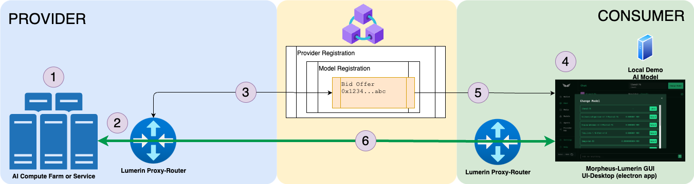

# Morpheus Lumerin Node

The purpose of this software is to enable interaction with distributed, decentralized LLMs on the Morpheus network through a desktop chat experience.

0. PreRequisites: Arbitrum Layer 2 Blockchain, Arbitrum MOR and Arbitrum ETH for staking and bidding
1. Existing, Hosted AI model that is available for inference via the Morpheus network
2. The proxy-router talks to and listens to the blockchain, routes prompts and inference between the providers’ models and the consumers that purchase and use the models
3. Providers register their models via bids on the blockchain
4. The consumer node is the “client” that will be purchasing bids from the blockchain, sending prompts via the proxy-router and receiving inference back from the provider’s models
5. Consumers purchase the bid and stake MOR for their session time
6. Once the bid has been purchased, prompt and inference (ChatGPT-like) can start

**Components that are included in this repository are:**
* Local `Llama.cpp` and tinyllama model to run locally for demonstration purposes only
* Lumerin `proxy-router` is a background process that monitors sepcific blockchain contract events, 
manages secure sessions between consumers and providers and routes prompts and responses between them
* Lumerin `ui-desktop` is the front end UI to interact with LLMs and the Morpheus network via the proxy-router as a consumer
* Lumerin `cli` is the cli client to interact with LLMs and the Morpheus network via the proxy-router as a consumer

## Tokens and Contract Information (update 11/15/2024)
### MainNet: (MAIN Branch and MAIN-* Releases)
* Morpheus MOR Token: `0x092bAaDB7DEf4C3981454dD9c0A0D7FF07bCFc86` 
* Diamond MarketPlace Contract: `0xDE819AaEE474626E3f34Ef0263373357e5a6C71b` 
* Blockchain Explorer: `https://arbiscan.io/`

### TestNet (DEV & STG Branches and TEST-* Releases)
* Morpheus saMOR Token: `0x34a285a1b1c166420df5b6630132542923b5b27e` 
* Diamond MarketPlace Contract: `0xb8C55cD613af947E73E262F0d3C54b7211Af16CF`
    * Interact with the Morpheus Contract: https://louper.dev/diamond/0xb8C55cD613af947E73E262F0d3C54b7211Af16CF?network=arbitrumSepolia#write
* Blockchain Explorer: `https://sepolia.arbiscan.io/`

## Funds
* **WALLET:** For testing as a provider or consumer, you will need both `MOR` and `ETH` tokens in your wallet. 
    * `MOR` is the token used to pay for the model provider staking and consumer usage
    * `ETH` is the token used to pay for the gas fees on the network  

## Installation & Operation 
* [00-Overview](docs/00-overview.md) - This provides a comprehensive picture of the Provider, Blockchain and Consumer environments and how they interact. This will also link to other documents for more advanced setup and configuration.

* [04-Consumer-Setup](docs/04-consumer-setup.md) - This is the simplest way to get started with the Morpheus Lumerin Node as a Consumer.  This will allow you to interact with the Morpheus network and the models offered on the network as a consumer running from packaged releases.

* [02-Provider-Setup](docs/02-provider-setup.md) - This is the simplest way to get started with the Morpheus Lumerin Node as a Provider.  This will allow you to connect your existing AI-Model to the Morpheus network and offer it for use by consumers.