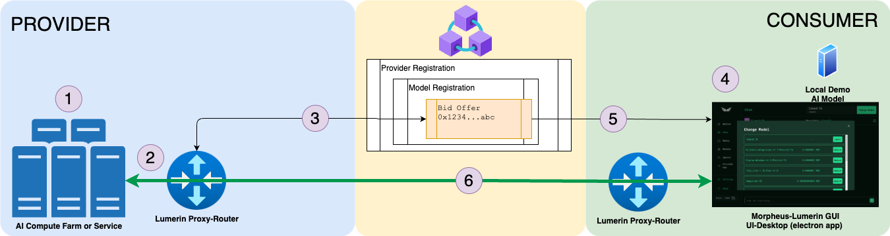

# Morpheus Lumerin Node

### Take part in the Lumerin coding weight rewards!! [stake.mor.lumerin.io](https://stake.mor.lumerin.io/)



The purpose of this software is to enable interaction with distributed, decentralized LLMs on the Morpheus network through a desktop chat experience.

> **v7.0.0 — Full TEE capability.** The v7 release completes a two-hop Trusted Execution Environment (TEE) trust chain for any model registered on-chain with the `tee` tag:
>
> - **Phase 1** — *consumer → P-Node.* A consumer proxy-router (v6.0.0+) cryptographically verifies the provider's P-Node runs the exact official hardened `-tee` image inside a genuine Intel TDX SecretVM, with TLS pinning, at session open and on every prompt.
> - **Phase 2 (new in v7)** — *P-Node → backend LLM.* The v7+ P-Node itself verifies the backend LLM it forwards inference to (CPU TDX quote, TLS pinning, workload RTMR3 replay of the backend's `docker-compose.yaml`, CPU-GPU nonce binding, and NVIDIA NRAS GPU attestation) at startup and on every prompt.
>
> Because Phase 2 runs inside the attested P-Node, **any v6+ consumer is forward-compatible with a v7+ provider** and gains the Phase 2 guarantees automatically — no client-side upgrade required. See the new [TEE reference](docs/providers/full/tee-reference.mdx), the [SecretVM quickstart](docs/providers/full/secretvm-quickstart.mdx), and the developer reference at [proxy-router/docs/tee-backend-verification.md](proxy-router/docs/tee-backend-verification.md).

## Documentation

The canonical documentation is in **[`/docs`](docs/)** and is built with [Mintlify](https://mintlify.com). It replaces the previous `00-overview.md` / `02-*.md` / `04-*.md` / `99-troubleshooting.md` set of files; old paths still resolve via redirects in [`docs/docs.json`](docs/docs.json).

To preview the site locally:

```bash
npm i -g mint
cd docs
mint dev
# open http://localhost:3000
```

The site is structured around **role-based journeys** (consumer / prosumer / provider tiers), with anti-hallucination [AI knowledge](docs/ai/) pages and curated mirrors of the broader [ecosystem](docs/ecosystem/) ([mor.org](https://mor.org), [tech.mor.org](https://tech.mor.org), [active.mor.org](https://active.mor.org), [MyProvider](https://myprovider.mor.org), [Everclaw](https://everclaw.xyz), [NodeNeo](https://nodeneo.io), [app.mor.org](https://app.mor.org)).

## What's in this repo

- Local `Llama.cpp` and tinyllama model to run locally for demonstration purposes only.
- Lumerin `proxy-router` — background process that monitors blockchain contract events, manages secure sessions between consumers and providers, and routes prompts and responses between them.
- Lumerin `MorpheusUI` — the Electron front end UI to interact with LLMs and the Morpheus network as a consumer.
- Lumerin `cli` — CLI client to interact with LLMs and the Morpheus network as a consumer.
- Kubo `ipfs` — IPFS client to store and retrieve model/agent files.

## End-to-end picture

0. **PreRequisites**: BASE Layer 2 Blockchain, MOR and ETH on BASE for staking and bidding.
1. Existing, Hosted AI model available for inference via the Morpheus network.
2. The proxy-router talks to and listens to the blockchain; it routes prompts and inference between providers' models and consumers.
3. Providers register their models via bids on the blockchain.
4. The consumer node is the "client" that purchases bids, sends prompts via the proxy-router, and receives inference back from the provider's models.
5. Consumers stake MOR to open a session for the duration they intend to use.
6. Once the session is open, prompt and inference (ChatGPT-like) can start.

## Tokens and contract information

| Item | BASE Mainnet | BASE Sepolia (testnet) |
|------|--------------|------------------------|
| Chain ID | `8453` | `84532` |
| Branch | `main` (`MAIN-*` releases) | `test` (`*-test` releases) |
| MOR Token | `0x7431aDa8a591C955a994a21710752EF9b882b8e3` | `0x5C80Ddd187054E1E4aBBfFCD750498e81d34FfA3` |
| Diamond Marketplace | `0x6aBE1d282f72B474E54527D93b979A4f64d3030a` | `0x6e4d0B775E3C3b02683A6F277Ac80240C4aFF930` |
| Block Explorer | https://base.blockscout.com/ | https://base-sepolia.blockscout.com/ |

You will need both **MOR** (for stake / fees / session payment) and **ETH on BASE** (for gas) in your wallet.

## Quickstart

| Role | Start here |
|------|-----------|
| Consumer (chat) | [Consumer quickstart](docs/get-started/quickstart-consumer.mdx) |
| Provider (host your own model) | [Provider quickstart](docs/get-started/quickstart-provider.mdx) |
| TEE provider (SecretVM) | [SecretVM quickstart](docs/providers/full/secretvm-quickstart.mdx) |
| Resale provider | [Resale overview](docs/providers/resale/overview.mdx) |
| Prosumer / agent | [Prosumer overview](docs/prosumers/overview.mdx) |
| Developer (API) | [API overview](docs/reference/api-overview.mdx) |

## For AI agents reading this repo

Start with [`AGENTS.md`](AGENTS.md) and the curated [AI knowledge](docs/ai/) section. Key anti-hallucination pages:

- [Where is my MOR?](docs/ai/where-is-my-mor.mdx)
- [Session states (open, close, recover)](docs/ai/session-states-open-close-recover.mdx)
- [Why is my MOR locked in the contract?](docs/ai/why-locked-in-contract.mdx)
- [Local vs blockchain models](docs/ai/local-vs-blockchain-models.mdx)
- [LLM prompt cheatsheet](docs/ai/llm-prompt-cheatsheet.mdx)
