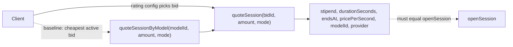
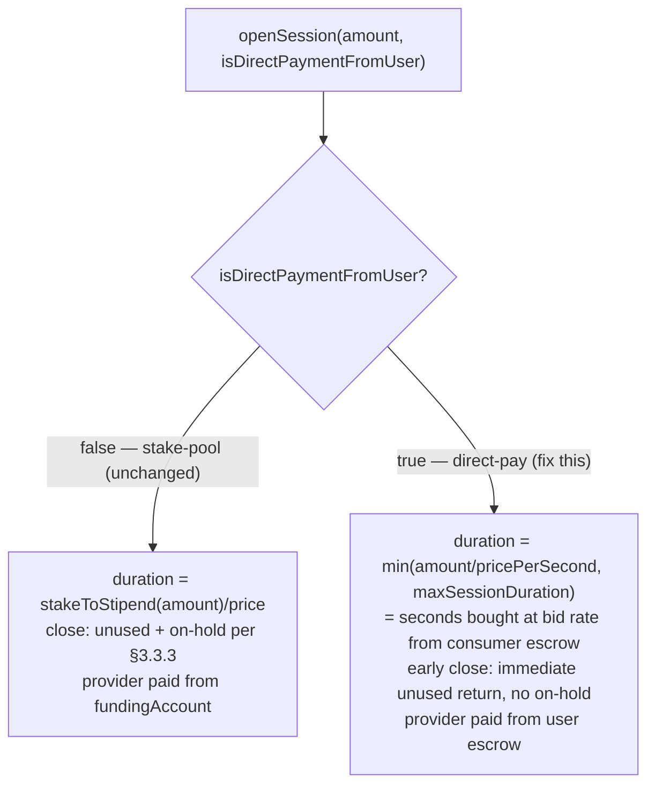
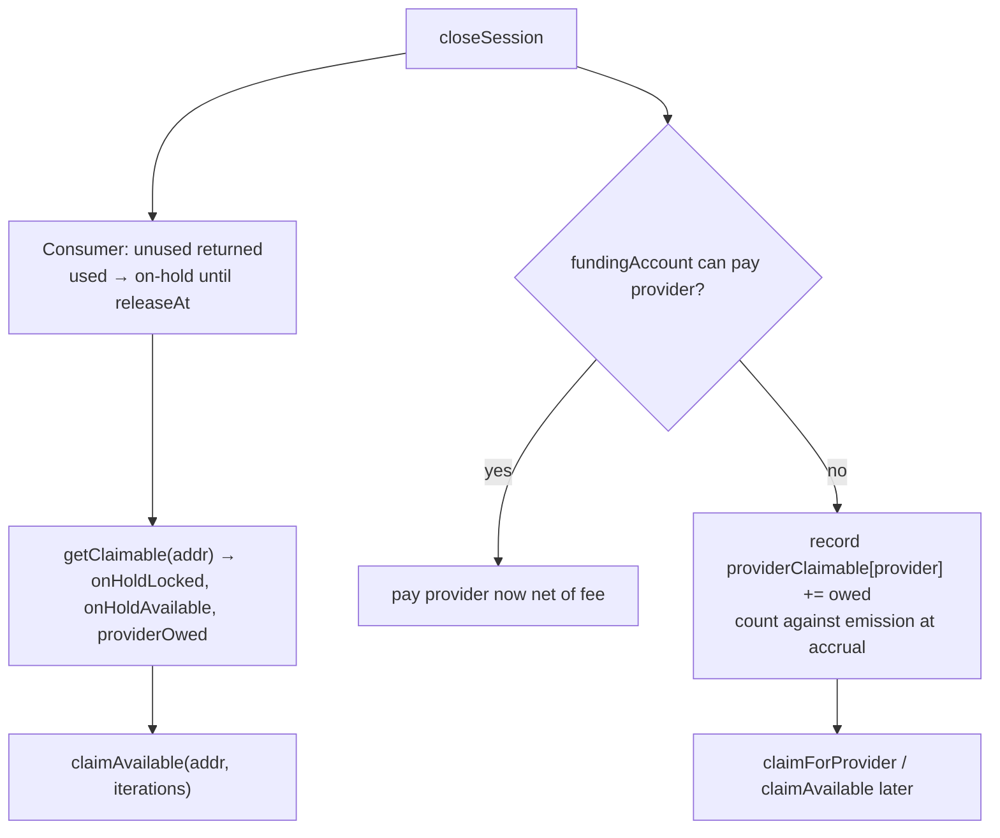
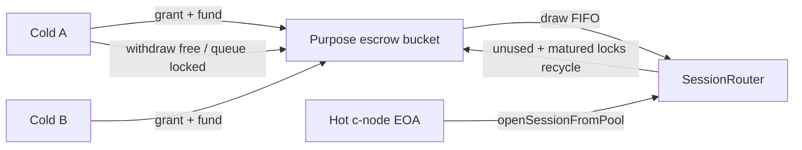

# Inference Contract Enhancements: Contractor RFP

**Product:** Morpheus Lumerin Node, Inference Diamond (BASE)  
**Repository:** [`smart-contracts/`](../)  
**Status:** Draft for contractor scoping  
**Last updated:** 2026-08-04  
**Audience:** Smart contract engineering contractor, Morpheus protocol team

---

## 1. Purpose

Scoping brief for **Inference Diamond contract changes**. Goal: simpler session UX, reliable settlement for both consumers and providers, marketplace DX, and cold/hot custody — without stranded MOR.

Proxy-router / node jobs that call these surfaces are **follow-on work** (they only wrap permissionless diamond calls). This RFP specifies what must be correct and complete **on-chain**. Post-cut client/docs/ops checklist: [`inference-contract-enhancements-downstream-checklist.md`](inference-contract-enhancements-downstream-checklist.md).

### 1.1 Problems to solve

| # | Problem | Why it hurts | Addressed in |
|---|---------|--------------|--------------|
| P1 | **Opaque session duration.** Stake-pool uses `stakeToStipend` (not raw amount÷price); direct-pay should use amount÷price — clients need both quoted on-chain. | Guessing either formula off-chain drifts from `openSession`. | §3.3.1 |
| P2 | **Direct-pay path is not amount×rate.** `isDirectPaymentFromUser` should mean: consumer pays `pricePerSecond × seconds` from escrow (easy to estimate). Today that flag mostly switches who pays the provider; duration/on-hold still follow **staking/stipend** math. | Direct-pay must be clear and accurate — **not the same as stake-pool.** | §3.3.2 |
| P3 | **Close coupled to funding wallet.** If `fundingAccount` cannot pay the provider, `closeSession` can revert. | Consumer unused stake and session finalization strand even when work is done. | §3.3.3 |
| P4 | **Diamond debts are hard to see and claim.** Consumer `userStakesOnHold` and unpaid provider entitlements lack a clear, bounded, address-keyed surface. | MOR sits claimable unnoticed; ops needs `cast`/custom scripts; pagination/bounds incomplete. | §3.3.3 |
| P5 | **No protocol take on provider payouts.** Marketplace has no conserved on-chain commission path. | Maintainers cannot fund ops from settlement without off-chain arrangements. | §3.3.4 |
| P6 | **Earnings and funding runway are opaque.** Limiter fields and funding-wallet health require bespoke reads. | Providers and ops cannot answer “what have I earned / what’s owed / how many days of runway?” in one call. | §3.3.5 |
| P7 | **Hot-wallet treasury exposure.** Day-locked stake means a high-volume consumer needs full daily float online. | Unacceptable custody risk; cold wallets cannot fund utilization without giving up keys. | §3.4.1 |
| P8 | **Dead node strands pool/session capital.** Close needs the hot key (and often a receipt); funding shortfalls block settlement paths. | Funders cannot recover if the c-node disappears; needs permissionless settle + provider claim decoupled from treasury. | §3.4.1, §3.3.3 |
| P9 | **Provider earnings land on the hot EOA.** No first-class cold/named payout target for claims (including deferred debts). | Operating key custodies income; deferred `providerOwed` must still reach the right recipient. | §3.4.2 |
| P10 | **Bid price changes require delete + repost.** Each repost charges the marketplace bid fee. | Setup and repricing burn MOR; no in-place update. | §3.1.1 |
| P11 | **Endpoint updates are implicit.** Done via `providerRegister(..., 0, endpoint)`. | Easy to misuse; no intention-revealing update + length bounds. | §3.2.1 |
| P12 | **Fragmented reads.** Session / bid / model / provider need many RPC calls. | Apps and indexers pay multicall complexity for basic views. | §3.5 |

### 1.2 Code references

| Facet | Path |
|-------|------|
| Marketplace | [`contracts/diamond/facets/Marketplace.sol`](../contracts/diamond/facets/Marketplace.sol) |
| ProviderRegistry | [`contracts/diamond/facets/ProviderRegistry.sol`](../contracts/diamond/facets/ProviderRegistry.sol) |
| SessionRouter | [`contracts/diamond/facets/SessionRouter.sol`](../contracts/diamond/facets/SessionRouter.sol) |
| Session struct | [`contracts/interfaces/storage/ISessionStorage.sol`](../contracts/interfaces/storage/ISessionStorage.sol) |
| _new_ DelegateStaking (or equivalent) | proposed (§3.4.1) |
| _new_ QueryFacet | proposed (§3.5) |

### 1.3 Related product docs

- [Session states (open, close, claim)](../../docs/ai/session-states-open-close-recover.mdx)
- [Why is my MOR locked?](../../docs/ai/why-locked-in-contract.mdx)
- [Tokens and fees](../../docs/concepts/tokens-and-fees.mdx)
- [Rewards and economics](../../docs/concepts/rewards-and-economics.mdx)

---

## 2. Guiding principles (NFRs)

Every change must satisfy these. They are acceptance gates, not optional style notes.

### F1: Additive upgrades; no flag-day

- Preserve existing external function signatures, event shapes, and storage slots (append-only Diamond storage). Never repurpose a slot.
- Prefer new functions/facets; keep existing call paths working until clients opt in.
- Each change declares a compatibility class: `Additive` | `In-place compatible` (same ABI; behavior may tighten, e.g. §3.3.2) | `Breaking` (**not accepted** in this RFP).
- Authoring: diagrams/pseudocode over Solidity except load-bearing signatures; every requirement has a verifiable `AC-*`.

### F2: No stranded funds; no privileged key required to settle

Value-bearing paths stay permissionless if every owner/operator key is lost:

- Open/close/settle sessions: `openSession`, `openSessionFromPool`, `closeSession`, `settleExpiredSession`
- Claim what the diamond owes: `claimForProvider`, `withdrawUserStakes`, and any new unified claim/sweep helpers (§3.3.3)
- Marketplace exit: `providerDeregister` + bond withdrawal; `postModelBid` / `deleteModelBid`

Close must not revert solely because `fundingAccount` cannot pay the provider (§3.3.3). Pool/session capital must be recoverable without the hot key (§3.4.1).

### F3: Minimal governance

| Tier | Who | Scope |
|------|-----|-------|
| **Owner** | Protocol multisig | Facet upgrades; bounded parameter tuning (bid update fee, provider fee, delegate-staking limits); emergency controls that **never** block settlement or claims |
| *(everyone)* | Any wallet | Bid, open/close/settle, claim balances the diamond owes them |

### F4: Mode clarity and money conservation

- **Direct-pay ≠ stake-pool.** `isDirectPaymentFromUser` selects distinct duration and early-close rules (§3.3.2). Quotes must match `openSession` **per mode**, not force one estimate for both (§3.3.1).
- **Emission conservation.** Fees and deferred provider debts cannot make the compute pool look healthier than it is (gross debit; accrue debts at close — §3.3.3–§3.3.4).
- **Fee path never bricks close.** Unset/`0` fee → provider gets 100%; no revert (§3.3.4).

### F5: Bounded gas; custody stays cold

- On-hold harvest, funder loops, and day-bucket release are hard-capped / paginated (no unbounded arrays — §3.3.3, §3.4.1).
- Delegated pool MOR never transfers to the hot wallet; hot utilizes escrow inside the diamond only (§3.4.1).

### F6: Diamond is source of truth

Balances owed, quotes, and claim paths live on-chain. Proxy-router / wallets / crons are follow-on callers of those surfaces — not part of this RFP’s deliverables.

---

## 3. Requested changes

| Section | Focus | Priority items |
|---------|-------|----------------|
| §3.1 | Marketplace | Update bid price without repost (M) |
| §3.2 | ProviderRegistry | Endpoint update + bounds (M/L) |
| §3.3 | SessionRouter | Quote (H), direct-pay path ≠ stake math (H), close + claimable balances both sides (H), provider fee (H), earnings + funding health (M) |
| §3.4 | Custody & delegation | Cold/hot staking pool (H/M), provider payout target (M), privacy assessment (L) |
| §3.5 | Query facet | Enriched session/bid/model views (H) |
| §3.6 | Hygiene | On-hold growth + rating events (L) |

---

## 3.1 Marketplace facet: bidding

**Intent.** Remove fee friction when changing bid price.

### 3.1.1 Update bid price without full repost (Priority: Med)

Today, changing price requires `deleteModelBid` + `postModelBid` (0.3 MOR fee each time).

**Requirements**
- **BID-R1** `updateBidPrice(bidId, newPricePerSecond)` only by active bid owner or authorized delegate.
- **BID-R2** Charge owner-settable `bidUpdateFee` (default 0.3 MOR). Same min/max price bounds as `postModelBid`.
- **BID-R3** Emit `MarketplaceBidUpdated`; leave `postModelBid` auto-delete-on-repost unchanged for new bids.

**Acceptance criteria**
- [ ] **AC-BID-1** Inactive/deleted bids cannot be updated.
- [ ] **AC-BID-2** Price bounds match `postModelBid`.
- [ ] **AC-BID-3** `postModelBid` creation flow unchanged.
- [ ] **AC-BID-4** Update → open session → close: settlement unchanged.
- [ ] **AC-BID-5** `bidUpdateFee` defaults to 0.3 MOR, is owner-settable, charged on update.

**Compatibility class:** `Additive`.

---

## 3.2 ProviderRegistry facet: provider identity

**Intent.** Clear endpoint updates; no change to provider stake/bond economics.

### 3.2.1 Explicit endpoint update + bounds (Priority: Med/Low)

Today endpoint updates are done via `providerRegister(..., amount_=0, endpoint)`.

**Requirements**
- **EP-R1** `providerUpdateEndpoint(endpoint)` by active provider/delegate only; no token transfer; stake unchanged.
- **EP-R2** Max endpoint length (e.g. 256 bytes) on new writes; existing records grandfathered.

**Acceptance criteria**
- [ ] **AC-EP-1** Only active provider/delegate; balances unchanged.
- [ ] **AC-EP-2** Bound enforced; document equivalence with `providerRegister(..., 0, endpoint)` if both remain.

**Compatibility class:** `Additive` + forward-only bound.

---

## 3.3 SessionRouter facet: sessions, settlement & fees

**Intent.** Legible pricing, distinct stake-pool vs user-escrow session semantics, reliable closes that never strand either side, and a clear on-chain picture of “what the diamond owes this address.”

### 3.3.1 Session quote view (Priority: High)

**Why.** Clients need a trustworthy answer to “if I lock X MOR on this bid, how long do I get?” before escrowing funds. That answer **depends on mode** (§3.3.2): stake-pool uses `stakeToStipend` (not raw `amount / price`); direct-pay should use `amount / pricePerSecond`. Re-implementing either formula off-chain drifts from `openSession`. The contract already owns the math; expose it as pure views.

**Need.** Authoritative, parity-tested quote helpers — by `bidId`, and a cheapest-bid baseline by `modelId` — for **each** `isDirectPaymentFromUser` value (estimates are not required to match across modes). Bid *selection* policy (rating) stays off-chain on the consumer node.

**Requirements**
- **QUOTE-R1** `view quoteSession(bidId, amount, isDirectPaymentFromUser)` → `stipend, durationSeconds, endsAt, pricePerSecond, modelId, provider`.
- **QUOTE-R2** `view quoteSessionByModel(...)` returns cheapest active bid (document tie-break); empty when none. Not presented as “best bid.”
- **QUOTE-R3** Returned duration/`endsAt` equals what `openSession` would set for the same inputs at `block.timestamp`.
- **QUOTE-R4** Covers both `isDirectPaymentFromUser` values (stake-pool and user-escrow).

**Acceptance criteria**
- [ ] **AC-QUOTE-1** Pure `view`; no state writes.
- [ ] **AC-QUOTE-2** Model quote = cheapest active bid baseline; docs state rating config owns selection.
- [ ] **AC-QUOTE-3** Parity with `openSession` (both modes).
- [ ] **AC-QUOTE-4** Both formulas documented: stake-pool (`stakeToStipend` / `getSessionEnd`) and direct-pay (`amount / pricePerSecond`, `maxSessionDuration`).

**Compatibility class:** `Additive`.

### 3.3.2 Make the direct-pay path clear and accurate (`isDirectPaymentFromUser`) (Priority: High)

**Read this first.** Direct-pay and staking are **not** supposed to share the same session math.

| Mode | Flag | How long you get (intended) | Who pays the provider | Early close (intended) |
|------|------|-----------------------------|----------------------|------------------------|
| **Direct-pay** (user escrow) | `isDirectPaymentFromUser == true` | **`amount / pricePerSecond`** (capped by `maxSessionDuration`) — seconds you bought at the bid rate; easy to estimate | Consumer escrow | Unused escrow back **immediately**; no `userStakesOnHold` |
| **Stake-pool** | `false` | **`stakeToStipend(amount) / pricePerSecond`** — different math (stipend) | `fundingAccount` | Unused return + used stipend on-hold (§3.3.3) |

**Why (today).** The flag mostly switches the **provider payout source**. Duration and early-close for `true` still follow the **staking/stipend** path, so direct-pay is neither clear nor accurate: you cannot treat escrowed MOR as “price × seconds from the consumer.”

**Need.** Fix the **direct-pay branch only** so it matches the table above. Leave stake-pool math alone. Quotes (§3.3.1) must show the two modes differently when the flag differs — parity is per mode, not “same estimate for both funding sources.”

**Requirements**
- **PAY-R1** Direct-pay: `endsAt = openedAt + min(amount / pricePerSecond, maxSessionDuration)` (consumer escrow buys that many seconds at bid price).
- **PAY-R2** Direct-pay early close: unused escrow returned immediately; no `userStakesOnHold` row.
- **PAY-R3** Stake-pool (`!isDirectPaymentFromUser`): existing stipend math and on-hold behavior **unchanged** (§3.3.3).
- **PAY-R4** Refine existing `isDirectPaymentFromUser` in place (no new ABI).

**Acceptance criteria**
- [ ] **AC-PAY-1** Direct-pay `endsAt` matches `min(amount/pricePerSecond, maxSessionDuration)`.
- [ ] **AC-PAY-2** Direct-pay early close: immediate unused return; zero on-hold rows.
- [ ] **AC-PAY-3** Stake-pool duration/on-hold **differs** from direct-pay where stipend ≠ amount/price; stake-pool regression vs today’s stipend path.
- [ ] **AC-PAY-4** Existing callers compile unchanged; migration note for clients.
- [ ] **AC-PAY-5** Matrix: both flag values × natural / early / dispute close; quotes for the same `amount` differ by mode when stipend math ≠ amount/price.

**Compatibility class:** `In-place compatible` (ABI), behavioral fix on `isDirectPaymentFromUser == true` only.

### 3.3.3 Close reliability & claimable balances (both sides) (Priority: High)

This section is **contract work**. Clients will later wrap the same diamond calls; they are not the deliverable here.

**Why — consumer side.** After close, unused stake returns in-tx; used stipend sits in `userStakesOnHold` until `releaseAt`. `getUserStakesOnHold` / `withdrawUserStakes` already exist, but:

- Visibility and pagination are incomplete / incorrect in places (e.g. `iterations` not fully honored), so “how much is locked vs claimable for address X?” is not reliably answerable from the diamond.
- Harvest loops need hard bounds so claims cannot be gas-griefed.
- There is no clean “sweep everything releasable for this user” path.

**Why — provider side.** On stake-pool sessions the provider is paid from `fundingAccount`. If that wallet’s balance or allowance is short, `closeSession` can **revert**, which strands the consumer’s close (and their unused stake) even though the session work is done. The diamond must instead finish the user side of close and **record what is owed to the provider** until the funding account is topped up — visible and claimable by (or for) the provider, without a special ops path.

**Need — one mental model.** For any address, the diamond should answer and pay:

| Bucket | Who | When claimable |
|--------|-----|----------------|
| Consumer on-hold (locked) | Session user | After each row’s `releaseAt` |
| Consumer on-hold (available) | Session user | Now via withdraw/sweep |
| Provider unpaid entitlement | Bid provider (or its `payoutTarget`, §3.4.2) | When funding account can pay; pull via claim |

Prefer **role-agnostic** read/claim entry points keyed by address (an address may be only a consumer, only a provider, or both). Role-specific helpers may remain as thin wrappers.

**Requirements — close path**
- **CLOSE-R1** Always complete the **consumer** side of close (unused return + on-hold for used stipend) even if the provider leg cannot be funded. Never revert the whole close solely because `fundingAccount` is short.
- **CLOSE-R1b** When the provider leg is deferred: record `providerClaimable[provider] += owed` (or equivalent), increment emission accounting **at accrual** (so the pool cannot look healthier than it is), and expose the outstanding total (see CLAIM-R* / §3.3.5). Paying later moves tokens only — counters already reflect the debt.
- **CLOSE-R2** At end of `closeSession`, auto-transfer that user’s on-hold rows already past `releaseAt`. Also provide permissionless `sweepReleasedStakes(user)` so anyone can push releasable consumer funds without waiting for another close.
- **CLOSE-R3** All harvest / withdraw loops are bounded and honor `iterations` (entries *examined*, not only removed). Emit `UserStakeOnHold` / `UserStakeReleased` (and a provider-debt event when CLOSE-R1b records an IOU).

**Requirements — claimable surface (role-agnostic)**
- **CLAIM-R1** `view getClaimable(address)` (name flexible) returns at least:
  - `consumerLocked` — sum of on-hold not yet past `releaseAt`
  - `consumerAvailable` — sum of on-hold past `releaseAt` (withdrawable now)
  - `providerOwed` — unpaid provider entitlements for this address (including when it is a `payoutTarget` if that is how routing is modeled)
  - Optional breakdowns / pagination cursors as needed for gas
- **CLAIM-R2** `claimAvailable(address, iterations)` (or equivalent) permissionlessly pays out whatever is currently payable for that address: consumer available on-hold **and** provider owed once funding can cover it (provider pull may remain `claimForProvider` if that already fits — but the **view** must still unify both buckets). Failures on one bucket must not permanently brick the other.
- **CLAIM-R3** Fix / complete existing `getUserStakesOnHold` + `withdrawUserStakes` so they are correct, bounded, and consistent with CLAIM-R1/R2 (wrappers or internals — no double-booking).
- **CLAIM-R4** Provider path: after CLOSE-R1b, a provider (or caller of `claimForProvider`) can see and pull exactly what is owed once `fundingAccount` is funded; amounts reconcile to session close events.

**Acceptance criteria**
- [ ] **AC-CLOSE-1** Unused stake still returns on close; used stipend still enters on-hold with current `releaseAt` formula (regression).
- [ ] **AC-CLOSE-2** After `releaseAt`, CLOSE-R2 / CLAIM-R2 return consumer funds without a stuck balance.
- [ ] **AC-CLOSE-3** Disputed close protective behavior unchanged.
- [ ] **AC-CLOSE-4** Under-funded `fundingAccount`: consumer close completes; `providerOwed` increases; later claim pays the provider (CLOSE-R1 / R1b).
- [ ] **AC-CLOSE-4b** Deferred leg increments emission counters + `pendingProviderClaims` / `providerOwed` at close; conservation holds.
- [ ] **AC-CLOSE-5** All harvest loops bounded; `iterations` honored on views and withdraws.
- [ ] **AC-CLAIM-1** `getClaimable(addr)` matches composing the underlying consumer on-hold + provider owed reads.
- [ ] **AC-CLAIM-2** An address that is both a session user with available on-hold and a provider with owed entitlement can see and claim both via the unified surface.
- [ ] **AC-CLAIM-3** Permissionless sweep/claim cannot steal funds for a different beneficiary.

> **Discussion:** Exact function names; whether provider pull stays as `claimForProvider` only with unified **views**, or one `claimAvailable` covers both.

**Compatibility class:** `Additive` (views/events/helpers); `In-place compatible` for CLOSE-R1 provider-pay timing.

**Follow-on (not this RFP):** proxy-router HTTP wrappers and optional node auto-claim jobs that call `getClaimable` / `claimAvailable` for the node wallet — possible only after the diamond surface above is correct ([#827](https://github.com/MorpheusAIs/Morpheus-Lumerin-Node/issues/827)).

### 3.3.4 Provider fee on payout (Priority: High)

Configurable platform commission (default 5%) on each provider payout. Deducted from the provider reward only — consumer refunds untouched. Owner-settable `feeBps` + `feeDestination`; skip (never revert) if unset or rate 0. `feeBps` changes take effect after a 7-day timelock.

**Requirements**
- **FEE-R1** Split at claim/close from the same source as the payout; consumer refundable stake never an input.
- **FEE-R2** Owner-settable `feeBps` (default 500) and `feeDestination`; `feeBps` timelocked 7 days; sanity bound ≤ 10000.
- **FEE-R3** Emission pool debited **gross**; per-provider `lifetimeClaimed` credited **net**; accumulate `protocolFeesCollected`.
- **FEE-R4** Unset destination or zero bps → provider gets 100%, no revert.
- **FEE-R5** Owner setters; emit `ProviderFeeCharged(...)`.
- **FEE-R6** `view getProtocolFeeSummary()` → rate, destination, total collected.

**Acceptance criteria**
- [ ] **AC-FEE-1** Defaults and timelock behave as specified.
- [ ] **AC-FEE-2** Both modes; net + fee reach correct destinations.
- [ ] **AC-FEE-3** Event fields correct.
- [ ] **AC-FEE-4** Unset/zero → full provider pay, no revert.
- [ ] **AC-FEE-5** Consumer refund identical with/without fee.
- [ ] **AC-FEE-6** Gross/net/`protocolFeesCollected` conservation per payout.
- [ ] **AC-FEE-7** Summary view reconciles to events.
- [ ] **AC-FEE-8** Property test: `periodPool == getComputeBalance() + Σ netPaid + protocolFeesCollected + pendingProviderClaims`.

**Compatibility class:** `Additive`.

### 3.3.5 Provider earnings & funding-health transparency (Priority: Med)

**Requirements**
- **EARN-R1** `view getProviderEarningsStatus(provider)` matching `_claimForProvider` fields: stake, period earned, remaining capacity, period end, plus `lifetimeClaimed` (net of §3.3.4 fee) and **`providerOwed`** (CLOSE-R1b unpaid).
- **EARN-R2** Values match live claim math (including period rollover).
- **EARN-R3** `view getFundingHealth()` → funding balance, allowance to Diamond, `getTodaysBudget`, outstanding provider debts, `protocolFeesCollected`.

**Acceptance criteria**
- [ ] **AC-EARN-1** Earnings fields match `_claimForProvider`.
- [ ] **AC-EARN-2** `lifetimeClaimed` net of fee when configured; `providerOwed` matches CLOSE-R1b ledger.
- [ ] **AC-EARN-3** Funding-health fields reconcile to ERC-20 / `getComputeBalance` reads; debts rise on deferred close and fall on claim.

**Compatibility class:** `Additive`.

---

## 3.4 Custody & delegation (cross-facet)

**Intent.** Split custody from operation: cold wallets hold MOR; hot node wallets operate sessions / receive payouts without treasury-scale hot balances.

Design here incorporates lessons from the closed exploration PR [#832](https://github.com/MorpheusAIs/Morpheus-Lumerin-Node/pull/832) (not shipped). That work proved the shape and surfaced mandatory hardening; this RFP requires those properties up front.

### 3.4.1 Consumer cold/hot staking pool (Priority: High)

**Why.** Used-stipend day-lock means a high-volume consumer node needs its **full daily staking float** available — not a recycled intra-day balance. Parking that in the hot wallet is unacceptable. Cold wallets must fund a purpose-bound pool the hot wallet can **utilize** without ever receiving the tokens, without ERC-20 allowance on the hot key, and without becoming the session actor as a cold address.

**Architecture (required shape)**
- New facet (e.g. `DelegateStaking`) + new diamond storage slot (append-only).
- Cold: `grantStakingAllowance(hot, cap, expiry)` + `fundStakingAllowance(hot, amount)` — capped, expiring, revocable, purpose-bound to session staking only.
- Hot opens via **`openSessionFromPool`** (existing `openSession` unchanged). Stake moves pool → session escrow **inside the diamond**; pool MOR must never transfer to the hot wallet.
- Draws debit funders FIFO; hot self-escrow last. On close, unused stake recycles **to the pool**, not to the hot wallet.
- Pool-funded sessions use stake-pool settlement only (`isDirectPaymentFromUser == false`). User-escrow mode from the pool would send funder MOR to a provider and break the custody invariant.
- Pool day-locks use **per-release-day buckets** that self-release lazily on the next pool draw/withdraw/close (no mandatory nightly housekeeping). Do not park pool locks in legacy `userStakesOnHold` (hot must not extract funder funds via `withdrawUserStakes`).

**Requirements**
- **COLDC-R1** Cold: `grantStakingAllowance(hot, cap, expiry)` — purpose-bound to session staking; Many:1 grants allowed.
- **COLDC-R2** Cold: `fundStakingAllowance(hot, amount)`; each funder’s unspent principal remains withdrawable by that funder.
- **COLDC-R3** One available-to-stake bucket per hot (sum of live grants + optional hot self-escrow).
- **COLDC-R4** Hot self-escrow via self-grant; debited last in FIFO.
- **COLDC-R5** Draws debit funders FIFO (oldest first); emit per-funder debit events.
- **COLDC-R6** Only the hot wallet (or its validated session delegatee) opens/closes/manages pool-funded sessions.
- **COLDC-R7** On close, unused stake recycles to the pool (not to the hot wallet); no new cold signature.
- **COLDC-R8** Cold withdraw: free balance immediately; shortfall queues (fungible, last-out waits); permissionless claim of pending; no pro-rata lock of all funders.
- **COLDC-R9** No path transfers pool MOR to the hot wallet or anywhere except session escrow / return-to-funder.
- **COLDC-R10** Views: allowance, available-to-stake, funders (paginated), pending withdrawal, pool balances / day-holds / session funding.
- **COLDC-R11 (funder cap)** Hard `maxActiveFunders` (owner-adjustable, default e.g. 64) bounding **every** funder loop. Gas-tested at the cap.
- **COLDC-R12 (delist dead grants)** Revoked grants leave draw traversal immediately; expired grants leave on next draw; withdrawal accounting retained.
- **COLDC-R13 (owner-adjustable params)** Min principal, funder cap, pending-withdraw batch, matured-bucket release batch, settlement grace — owner setters; zero = built-in default (no cut-time initializer).
- **COLDC-R14 (settleExpiredSession)** After `endsAt + grace`, **anyone** may settle: no receipt, no hot key; user-side math anchored to `endsAt`; **no provider transfer** (provider uses claim path — F2 / §3.3.3).
- **COLDC-R15** Distinct reverts: insufficient liquid balance vs insufficient authorized capacity.
- **COLDC-R16** Clear accounting fields (e.g. `cumulativeFundingCap`, `lifetimeFunded`, `currentPrincipal`). Invariant: `Σ currentPrincipal + pendingTotal == freeBalance + lockedBalance`.
- **COLDC-R17** Pending withdrawals coalesce to one queue node per funder.
- **COLDC-R18** Session/user approval binding: cannot open a session for the wrong user when delegates are involved.
- **COLDC-R19 (v1 funder economics)** Document: funders are operator-affiliated (or off-chain compensated); **no on-chain yield**; shared-liquidity disclosure.
- **COLDC-R20 (forward-only upgrades)** No inverse cut that restores a pre-pool SessionRouter over live pool state.

**Acceptance criteria**
- [ ] **AC-COLDC-1** No grant/self-escrow → cannot open pool-funded session.
- [ ] **AC-COLDC-2** Grant+fund → hot opens without cold key per session; hot receives no pool MOR.
- [ ] **AC-COLDC-3** Many:1 FIFO debit and recycle attribution correct.
- [ ] **AC-COLDC-4** Withdraw while in use: free now, remainder pending; other funders not pro-rata locked.
- [ ] **AC-COLDC-5** Cap enforced; worst-case draw/close/release at cap fits a block.
- [ ] **AC-COLDC-6** Revoked/expired grants cannot inflate draw gas; funds still withdrawable.
- [ ] **AC-COLDC-7** Dead hot wallet: after grace, `settleExpiredSession` returns/recycles with funding wallet empty; provider still claimable separately.
- [ ] **AC-COLDC-8** Pool day-locks self-release without housekeeping.
- [ ] **AC-COLDC-9** Solvency invariant holds across mixed open/close/withdraw/settle.
- [ ] **AC-COLDC-10** Docs state v1 funder economics + shared-liquidity disclosure.

**Compatibility class:** `Additive` (`openSession` untouched; new pool open path).

### 3.4.2 Provider cold payout target (Priority: Med)

**Why.** Provider operating keys are hot; earnings should land in a cold vault (or named recipient) without changing who runs the node. Combined with §3.3.3, unpaid entitlements (`providerOwed`) must also be claimable **to that target** once the funding account can pay — not stuck on the hot EOA.

**Requirements**
- **COLDP-R1** Provider sets `payoutTarget`; provider payouts (immediate or deferred claim) go to that address.
- **COLDP-R2** Only provider/delegate may change; default = provider address.
- **COLDP-R3** `claimForProvider` / CLAIM-R2 stay permissionless (F2); only the destination changes.
- **COLDP-R4** Fee (§3.3.4) applied before routing to `payoutTarget`.
- **COLDP-R5** `view getPayoutTarget(provider)`; `getClaimable(payoutTarget)` / `getClaimable(provider)` must make owed amounts discoverable (document which address indexes the debt).
- **COLDP-R6** Setting/clearing `payoutTarget` must not strand already-recorded `providerOwed` — debts remain claimable to the configured recipient at claim time (specify and test the chosen rule).

**Acceptance criteria**
- [ ] **AC-COLDP-1** Net rewards land at target when set.
- [ ] **AC-COLDP-2** Unset → pays provider (regression).
- [ ] **AC-COLDP-3** Auth + event + view correct.
- [ ] **AC-COLDP-4** Fee split before routing.
- [ ] **AC-COLDP-5** CLOSE-R1b debt → claim pays `payoutTarget` when set; visible via claimable views.

**Compatibility class:** `Additive`.

### 3.4.3 Privacy / masking (Priority: Low, assessment)

Document residual on-chain linkability of grant/`payoutTarget` mappings. Do not introduce external privacy infra. Hot wallet remains the session actor.

**Acceptance criteria**
- [ ] **AC-PRIV-1** Written linkability assessment (consumer + provider).
- [ ] **AC-PRIV-2** No external privacy dependencies.

**Compatibility class:** `Additive` (assessment only).

---

## 3.5 Read / Query facet

### 3.5.1 Enriched session / bid / model views (Priority: High)

**Requirements**
- **VIEW-R1** `getSessionDetails(sessionId)` → session + bid + model + provider.
- **VIEW-R2** `getActiveBidsForModel(modelId)` → bids + provider meta.
- **VIEW-R3** `getUserSessionsEnriched(user)` (name distinct from legacy) with computed status; paginated.
- **VIEW-R4** All `view`; reuse `Paginator`.

**Acceptance criteria**
- [ ] **AC-VIEW-1** View-only.
- [ ] **AC-VIEW-2** Equals composing single-entity getters.
- [ ] **AC-VIEW-3** Pagination + gas benchmarks.

**Compatibility class:** `Additive`.

---

## 3.6 Storage hygiene & future

### 3.6.1 Storage hygiene (Priority: Low)

- **HYG-R1** Audit `userStakesOnHold` and pool day-bucket growth; document steady state with CLOSE-R2 / pool lazy release; keep harvest paginated.
- **HYG-R2** Storage-layout-safe plan for any clearly dead fields (remove vs leave dormant).

**Acceptance criteria**
- [ ] **AC-HYG-1** Written growth analysis.
- [ ] **AC-HYG-2** No slot repurposing (F1).

### 3.6.2 Rating / dispute outcomes (Priority: Low)

- **RATE-R1** Emit structured dispute/rating events; no new fund logic.
- [ ] **AC-RATE-1** Stable schema; settlement untouched.

---

## 4. Deliverables & verification

### 4.1 Governed parameters

| Parameter | Default | Bounds | Timelock | Defined in |
|-----------|---------|--------|----------|------------|
| `bidUpdateFee` | 0.3 MOR | sanity bound | none | §3.1.1 |
| `feeBps` | 500 (5%) | 0 .. 10000 | **7 days** | §3.3.4 |
| `feeDestination` | maintainer multisig | any; `address(0)` disables | none | §3.3.4 |
| Delegate-staking operational limits | see §3.4.1 COLDC-R13 | owner-settable; 0 = default | none | §3.4.1 |

### 4.2 Deliverables

- Solidity + tests for every `AC-*`
- Storage-layout report (no slot repurposing)
- Client-impact note for any in-place behavior change
- Gas benchmarks for paginated reads, harvest loops, and capped funder draw/close
- Upgrade runbook with **forward-only** policy for pool-aware SessionRouter cuts

### 4.3 Verification

1. Traceability matrix: every `AC-*` → named test(s)
2. Property/fuzz tests for AC-FEE-8 and AC-CLOSE-4b
3. Bus-factor drill (F2): bid → open → close → claim/settle/withdraw with privileged keys unavailable
4. Dual-role claim test: same address with consumer available on-hold + provider owed
5. Pool dead-node test: `settleExpiredSession` with empty funding wallet
6. Review gate: compatibility class verifiable from ABI diff + storage report

### 4.4 Out of scope

- ModelRegistry redesign
- Provider stake/bond economics changes
- Provider reward-limiter / emission-budget redesign
- Changing used-stipend day-lock policy
- Proxy-router HTTP routes / auto-claim crons (follow-on once §3.3.3 diamond surface exists)
- What `feeDestination` does with collected MOR
- Hosted Inference API billing; Capital Contract; TEE attestation implementation
- External privacy infrastructure beyond §3.4.3 assessment
- On-chain funder yield / marketplace for strangers funding a hot wallet (v1 explicitly operator-affiliated)
